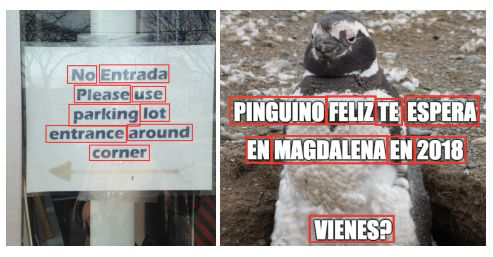
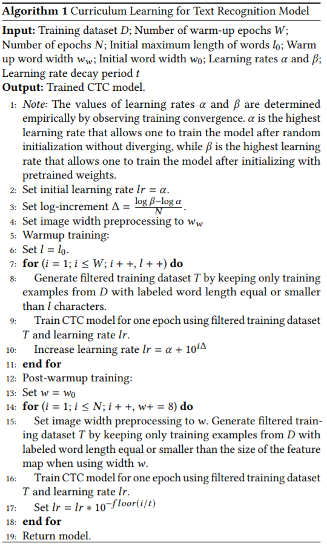

现在光学字符识别（OCR）基本都是基于相同框架，即第一步进行文本检测，第二步进行文本识别。这里以Facebook的[Rosetta](https://code.fb.com/ai-research/rosetta-understanding-text-in-images-and-videos-with-machine-learning/)为例进行讲解，[论文](https://www.kdd.org/kdd2018/accepted-papers/view/rosetta-large-scale-system-for-text-detection-and-recognition-in-images)已由KDD收录。

在 OCR 任务中，给出一张图像，OCR 系统可以准确地提取出印刷或嵌入图像中的文本。随着大量字体、语言、词典和其他语言变体（包括特殊符号、不在词典内的单词，以及 URL 和电邮 id 等特殊信息）出现在图像中，图像质量随着文本出现的背景不同而出现变化，OCR 任务的难度增大。另一个原因是每天上传至社交媒体、需要处理的图像规模非常巨大。由于下游应用的本质，人们对 OCR 任务的期待是实时处理，这要求我们花费大量时间优化系统各部分，以在合理的延迟时间内执行 OCR 任务。因此，OCR 任务的相关问题可以描述如下：构建稳健、准确率高的 OCR 系统，能够实时处理每天数以亿计的图像。

Facebook 的可扩展 OCR 系统 Rosetta，该系统已经被实现和部署在生产中，并主导了 Facebook 内的下游应用。Rosetta 遵循当前最优 OCR 系统的架构，分为文本检测阶段和文本识别阶段两部分。文本检测方法基于 Faster-RCNN 模型，负责检测图像中包含文本的区域。文本识别方法使用全卷积字符识别模型，处理检测到的区域，并识别这些区域所包含的文本内容。下图展示了 Rosetta 生成的一些结果。

第一步中（文本检测），我们检测图像中有可能包含文本的矩形区域。第二步执行文本识别，即使用 CNN 对检测出的每一个区域中的文字进行识别和转录。这个流程有诸多好处，如分离训练过程和文本检测、识别模型的部署更新、并行运行文本识别，以及独立支持对不同语言的文本识别。模型架构如下图

## Source

[https://code.fb.com/ai-research/rosetta-understanding-text-in-images-and-videos-with-machine-learning/](https://code.fb.com/ai-research/rosetta-understanding-text-in-images-and-videos-with-machine-learning/) [https://www.kdd.org/kdd2018/accepted-papers/view/rosetta-large-scale-system-for-text-detection-and-recognition-in-images](https://www.kdd.org/kdd2018/accepted-papers/view/rosetta-large-scale-system-for-text-detection-and-recognition-in-images) [https://www.jiqizhixin.com/articles/2018-08-11-23?from=synced&keyword=ocr](https://www.jiqizhixin.com/articles/2018-08-11-23?from=synced&keyword=ocr)
