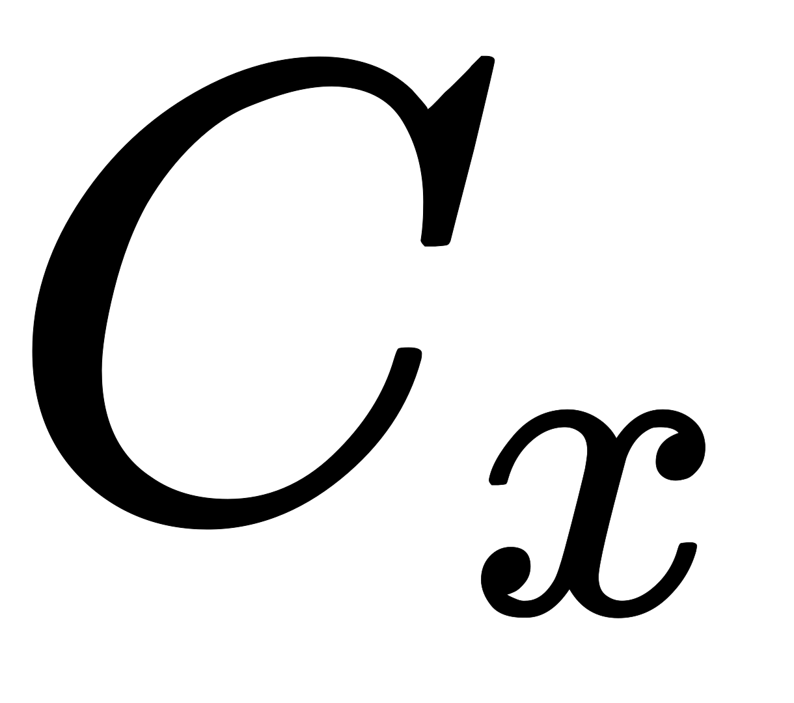
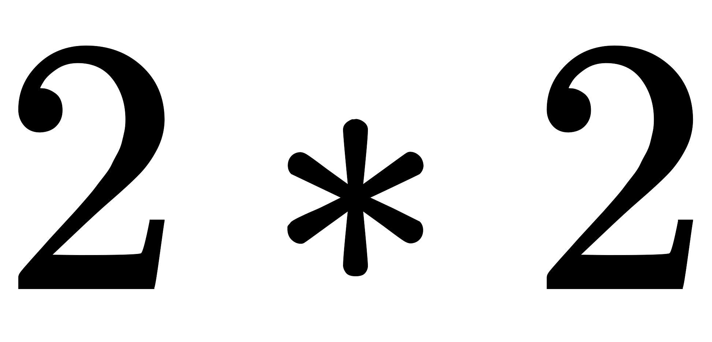

<a name="601bfdb8"></a>
## LeNet-5简介

LeNet-5是1998年LeCun发表的用于手写字符识别的经典卷积神经网络模型。当年美国很多银行就采用了这种模型来识别支票上的手写数字，能够达到如此高的商业程度，可见其识别精准和在深度学习发展史上的重要地位。

LeNet-5在论文中被用于识别MNIST数据集提供的0~9共10个手写数字。MNIST是当时Google实验室的Corinna Cortes和纽约大学柯朗研究所的Yann LeCun共同建立的手写数字数据库，包含训练集60000张即测试集10000张手写数字图片。该数据集提供的图片尺寸统一为，图中包含字符的最大尺寸为。

231n中对LeNet的评价：

**LeNet**. The first successful applications of Convolutional Networks were developed by Yann LeCun in 1990’s. Of these, the best known is the [LeNet](http://yann.lecun.com/exdb/publis/pdf/lecun-98.pdf) architecture that was used to read zip codes, digits, etc.

<a name="ba210197"></a>
## LeNet-5详解

LeNet-5网络除输入层外包含7层，每层都含有可学习的参数。如下图所示，卷积层标记为，下采样层标记为，全连接层标记为，其中表示层下标（这个下标是指的在网络中的顺序，不是第几个这样的层）。


**输入：**的手写字体图片，这些手写字体包含0~9数字，也就是相当于10个类别的图片。网络输入是像素的图片，这一尺寸明显大于MNIST提供的字符尺度（）。这样设计的原因是希望如笔画末端或尖端等潜在的有效特征能够出现在最高层特征检测子感受野的中心位置，换句话说，网络高层的各个特征都集成了笔画和尖角边缘信息。在LeNet-5中，最后一个卷积层（）的所有感受野中心会在输入的像素像素图片中形成一个的区域。此外，还需对输入像素的取值进行标准化：白色背景取值，黑色前景取值，这样使得在MNIST数据集上像素点取值均值近似为，方差近似为。数据标准化能够有效地加速训练过程。

**输出：**分类结果，0~9之间的一个数。因此我们可以知道，这是一个多分类问题，总共有十个类，因此神经网络的最后输出层必然是SoftMax问题，然后神经元的个数是10个。

<a name="44225dfa"></a>
### 输入层

**输入层：**的图片（因为是灰度图，所以其实是），也就是相当于1024个神经元。

<a name="c3f1d3bd"></a>
### 第一层(卷积)

**层：**是网络的第一个卷积层，paper这里选择6个卷积核，卷积核大小选择，这样我们可以得到6个特征图，每个特征图大小为（），也就是神经元的个数为。所以现在我们的维度从变成了


<a name="1d2a4170"></a>
### 第二层(下采样)

**层：**是下采样层，也就数使用最大池化进行下采样，池化的大小选择(2,2)，也就相当于对层的图片，进行分块（即邻域），每个块的大小为，这样我们可以得到个块，我们统计每个块中最大的值作为下采样的新像素，因此我们可以得到大小的图片，共有6个这样的图片。至此我们的维度从变成了。在最初的论文中，会将邻域里的4个值求和乘系数并加上一个偏置，所得结果再通过Sigmoid激活函数来产生层的特征图。这里系数和偏置是本层需要学习的参数。在后来的实现中，常用最大池化取代上述过程。


<a name="ca74e47f"></a>
### 第三层(卷积-关键)

**层：**同样是卷积层，这一层卷积核大小仍未，据此我们可以得到新的图片大小为（），然后我们希望可以得到16张特征图，即我们的维度从变成。


那么问题来了，这一层是最难理解的，我们知道包含：6张大小的图片，我们希望这一层得到的结果是：16张的图片。这16张图片的每一张，是通过的6张图片进行加权组合得到的，具体怎么组合如下面所示：


前6个特征图与层相连的3个特征图相连接，后面6个特征图与层相连的4个特征图相连接，后面3个特征图与层部分不相连的4个特征图相连接，最后一个与层的所有特征图相连。卷积核大小仍然为，所以共有 个参数，而不是个参数，而不是个参数。因为图像大小是，所以共有个连接而不是个。每个层的特征图只与部分层的特征图进行连接，这样做有两个原因：

- 部分不完全的连接能够将连接数控制在一个比较合理的范围内。
- 更重要的是，它强制地打破了网络的对称性，不同的特征图由于输入不同而能够表达出不同的特征。

<a name="200fb8c6"></a>
### 第四层(下采样)

**层：**也是下采样层，采用同样的下采样方式，得到16个的特征图。我们的维度从变成。


<a name="e06409a6"></a>
### 第五层(卷积)

层：这一层是网络最后一个卷积层，具有120个特征图，每个特征图与层所有的特征图相连接，卷积核大小是，而层的特征图大小也是，所以层的特征图就变成了大小的特征图。即维度从变成。共有个参数。


当特征图尺寸为时，层等价于一个全连接层。但我们仍以卷积层来命名它，因为当输入图片尺寸增大时，网络结构不发生变化。

<a name="54ab53be"></a>
### 第六层(全连接)

层是与层相连，包含84个单元的全连接层，即有个参数 。这一层采用了正切函数，即


<a name="b8ba1121"></a>
### 输出层

最后，输出层由每个类别对应一个欧几里得RBF(Euclidean Radial Basis Function)单元构成。每个RBF单元的输入均为层的84个输出，输出计算公式如下：


换言之，每个RBF单元计算的输入向量和参数向量之间的欧式距离，输入向量与参数向量之间的距离越远，RBF单元的输出越大。对于一个特定的RBF单元，其输出可以理解成衡量输入向量和对应类别之间匹配程度的一个惩罚项。从概率的观点看，RBF核的输出也可以理解成在由层定义的高斯分布下一个未经归一化的负对数似然。由此，给定一个输入，损失函数将定义为使得层输出尽量接近期望类别的RBF参数向量。采用这种方式，RBF单元的参数向量需要手动给出，并保持固定（至少在初始的时候），参数向量的每个元素取-1或1。

事实上，在以后的实践中，RBF单元常常被Softmax所取代。


<a name="0d053b6e"></a>
## Code实现

```python
def LeNet():
    model = Sequential()
    model.add(Conv2D(32,(5,5),strides=(1,1),input_shape=(28,28,1),padding='valid',activation='relu',kernel_initializer='uniform'))
    model.add(MaxPooling2D(pool_size=(2,2)))
    model.add(Conv2D(64,(5,5),strides=(1,1),padding='valid',activation='relu',kernel_initializer='uniform'))
    model.add(MaxPooling2D(pool_size=(2,2)))
    model.add(Flatten())
    model.add(Dense(100,activation='relu'))
    model.add(Dense(10,activation='softmax'))
    return model
```

<a name="Source"></a>
## Source

[https://engmrk.com/lenet-5-a-classic-cnn-architecture/](https://engmrk.com/lenet-5-a-classic-cnn-architecture/)<br />[https://blog.csdn.net/xuanyuansen/article/details/41800721](https://blog.csdn.net/xuanyuansen/article/details/41800721)<br />[http://cs231n.github.io/convolutional-networks/#case](http://cs231n.github.io/convolutional-networks/#case)<br />[https://www.cnblogs.com/skyfsm/p/8451834.html](https://www.cnblogs.com/skyfsm/p/8451834.html)
