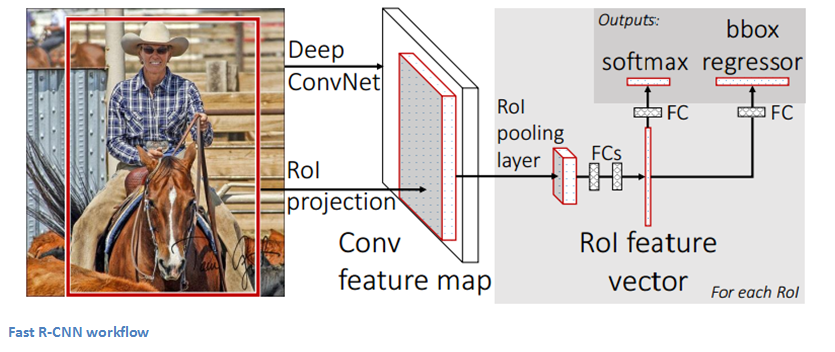

## Fast R-CNN思路

Fast R-CNN是要解决R-CNN和SPP-net 2000个左右候选框带来的重复计算问题，其主要思想为：

- 使用一个简化的SPP层——RoI（Region of Interest）池化层，操作与SPP类似。
- 训练和测试时不再分多步：不再需要额外的硬盘来存储中间层的特征，梯度能够通过RoI池化层直接传播；此外，分类和回归用Multi-task的方式一起进行。
- SVD：使用SVD分解全连接层的参数矩阵，压缩为两个规模小很多的全连接层。

## Fast R-CNN步骤

如下图所示，Fast R-CNN的主要步骤如下：

（1）特征提取：以整张图片为输入，利用CNN得到图片的特征层

（2）区域提名：通过选择性搜索等方法从原始图片中提取区域候选框，并把这些候选框一一投影到最后的特征层

（3）区域归一化：针对特征层上的每个区域候选框进行RoI池化操作，得到固定大小的特征表示

（4）分类与回归：通过两个全连接层，分别用Softmax多分类目标识别，用回归模型进行边框位置与大小微调

## Source

[https://arxiv.org/pdf/1504.08083.pdf](https://arxiv.org/pdf/1504.08083.pdf)
