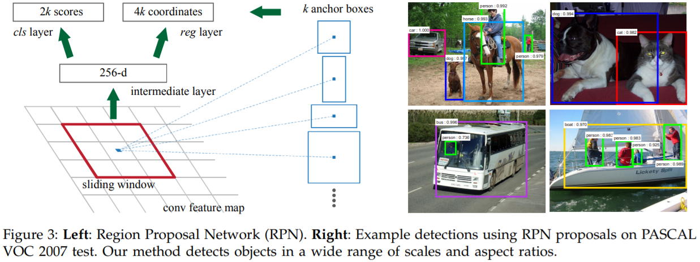
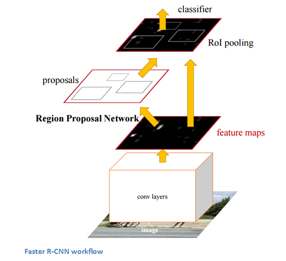

## Faster R-CNN思路

Fast R-CNN使用选择性搜索来进行区域提名，速度依然不够快。[Faster R-CNN](https://arxiv.org/pdf/1506.01497.pdf)则直接利用RPN（Region Proposal Network）网络例计算候选框。RPN以一张任意大小的图片为输入，输出一批矩形区域提名，每个区域对应一个目标分数和位置信息。Faster R-CNN中的RPN网络结构如下图（左）所示：

## Faster R-CNN步骤

（1）特征提取：同Fast R-CNN，以整张图片为输入，利用CNN得到图片的特征层

（2）区域提名：在最终的卷积特征层上为每个点利用个不同的矩形框（Anchor Box）进行提名，一般取9

（3）区域判定和回归：对每个矩形框对应的区域进行object/non-object二分类，并用个回归模型（各自对应不同的矩形框）微调候选框位置与大小

（4）分类与回归：对区域提名网络给出的区域结果进行筛选，进行目标分类和边框回归

总之，Faster R-CNN抛弃了选择性搜索，引入了RPN网络，使得区域提名、分类、回归一起共用卷积特征，从而得到进一步的加速。但是，Faster R-CNN仍然分成两步：对两万个矩阵框先判断是否是目标（目标判定），然后再进行目标识别。

## Source

[https://arxiv.org/pdf/1506.01497.pdf](https://arxiv.org/pdf/1506.01497.pdf)
