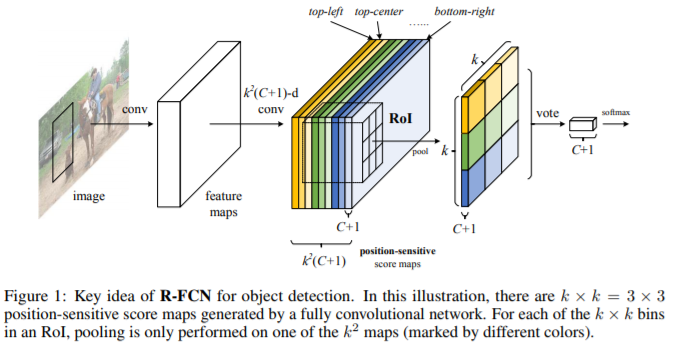
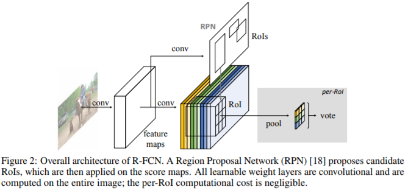
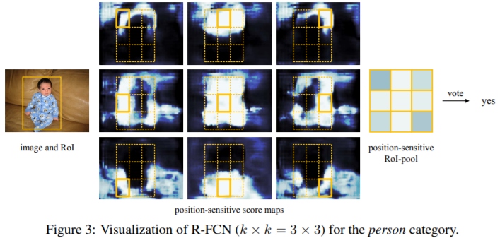
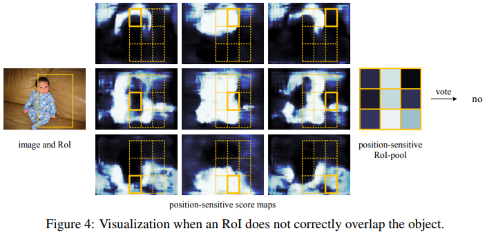

## R-FCN思路

前面的目标检测方法都可以细分为两个子网络：共享的全卷积网络和不共享计算的与RoI相关的子网络（比如全连接网络）。

R-FCN将最后的全连接层之类的换成了一个位置敏感的卷积网络，从而让所有计算都可以共享。具体来说，先把每个提名区域划分为个网络，比如R-FCN原论文中的取值为3，则对应的9个网格分别表示左上、上中...右下，对应于figure3、4中的九宫格及figure2中的不同颜色的块，每个网络都有对应的编码，但预测时会有个输出，表示类别数量，是因为有背景类别，全部的输出通道数量为。

   

需要注意的是，figure3、4和figure2中的不同位置都存在一个九宫格，但是池化时只有一个起作用，比如bottom-right层只有右下角的小块起作用。那么问题来了，这一层其他的8个框有什么作用呢？答案是它们可以作为其他RoI（偏左或偏上一些的RoI）的右下角。

## R-FCN步骤

（1）区域提名：使用RPN（Region Proposal Network，区域提名网络），RPN本身是全卷积网络结构的

（2）分类与回归：利用和RPN共享的特征进行分类。当进行bbox回归时，则将设置为4。

## Source

[https://arxiv.org/abs/1605.06409](https://arxiv.org/abs/1605.06409)
