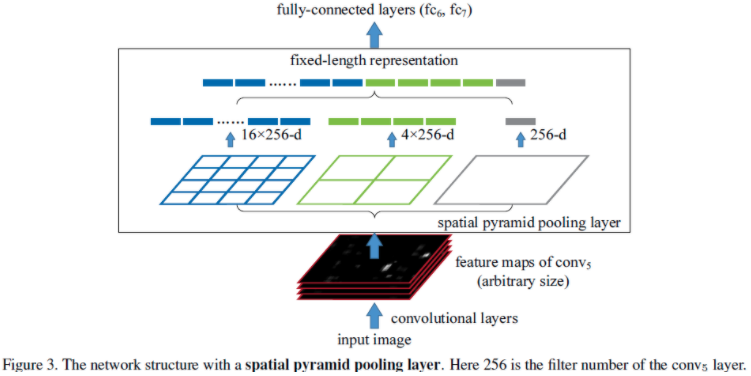

SPP-net是何恺明于14年撰写的论文，主要是把经典的空间金字塔池化层（Spatial Pyramid Pooling，SPP）结构引入CNN中，从而使CNN可以处理任意size和scale的图片。这种方法不仅提升了分类的准确率，而且还非常适合目标检测，比经典的RNN快速准确。

## SPP-net思路

之所以引进SPP层，主要原因是CNN的全连接层要求输入图片的大小一致，而实际中的输入图片往往大小不一，如果直接缩放到同一尺寸，很可能有的物体会充满满张图片，而有的物体只占到图片的一角。目前流行的CNN都需要固定size和scale的输入图片；所以基本上都是通过剪裁（crop）和wrap（拉伸）。这种处理方式有三个弊端：

- 裁剪的图片可能不包含整个物体
- 拉伸导致物体变形
- 当物体大小改变时，预定义的scale可能不适合物体的变化

SPP-net引入Spatial PyramidPooling 层SPP，通过SPP来移除CNN对于固定输入的要求，SPP操作类似深层的信息“融合”。这种深层的信息融合类似人脑的分级信息处理方式；当我们看到一个物体时，在一开始我们把物体看成一个整体而不是剪裁一个部分；通过融合先前处理的信息，大脑处理在深层阶段识别各种形状的物体。具体操作可简单解释为，SPP对整图提取固定维度的特征，再把图片均分为4份，每份提取相同维度的特征，再把图片均分为16分，以此类推。可以看出，无论图片大小如何，提取出来的数据维度是一致的，这样就可以统一送至全连接层了。

SPP的优点在于：

- 不论输入图片大小是多少，SPP都能抽取到固定长度的特征。
- SPP使用了多级的空间尺度特征，鲁棒性更好。
- 由于输入维度可变，SPP能够在不同的维度抽取特征。

SPP-net解决了R-CNN区域题名时crop/warp带来的偏差问题，提出了SPP层，网络可以对任意尺度和长宽比的目标物体进行处理，不需要直接对候选框对应图像进行裁剪或拉伸操作，但其他方面依然和R-CNN一样，因而仍然存在不少问题，这就有了后面的Fast R-CNN。

## SPP-net步骤

SPP-net进行目标检测的主要步骤如下：

（1）区域提名：用选择性搜索从原图生成2000个左右的候选框

（2）区域大小缩放：SPP-net不再做区域大小归一化，而是缩放到，即统一图像长宽尺寸中最短边长度，选自中的一个，选择的标准是使得缩放后的目标物体候选框大小与224*224最接近

（3）特征提取：利用SPP-net网络结构提取特征

（4）分类与回归：类似于R-CNN，利用SVM基于上面的特征训练分类器模型，用边框回归来微调候选框的位置

SPP-net结构如上图所示，可以看到，实质上式最后的一个卷积层后加了一个SPP层，将维度不一的卷积特征转换为维度一致的全连接输入。根据pooling规则，每个pooling bin（window）对应一个输出，所以最终pooling后特征输出由bin的个数来决定。本文就是分级固定bin的个数，调整bin的尺寸来实现多级pooling固定输出。

如上图所示，layer-5的unpooled FM维数为16*24，按照图中所示分为3级（图片从右至左），

- 第一级bin个数为1，最终对应的window大小为16*24；
- 第二级bin个数为4个，最终对应的window大小为4*8；
- 第三级bin个数为16个，最终对应的window大小为1*1.5（小数需要舍入处理）

## Source

[https://blog.csdn.net/whiteinblue/article/details/43415035](https://blog.csdn.net/whiteinblue/article/details/43415035)
