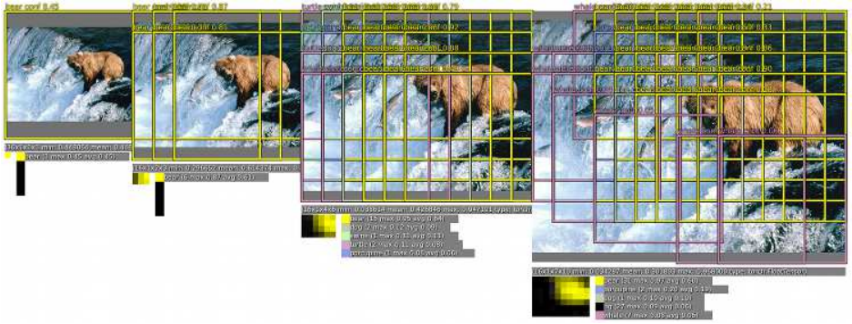
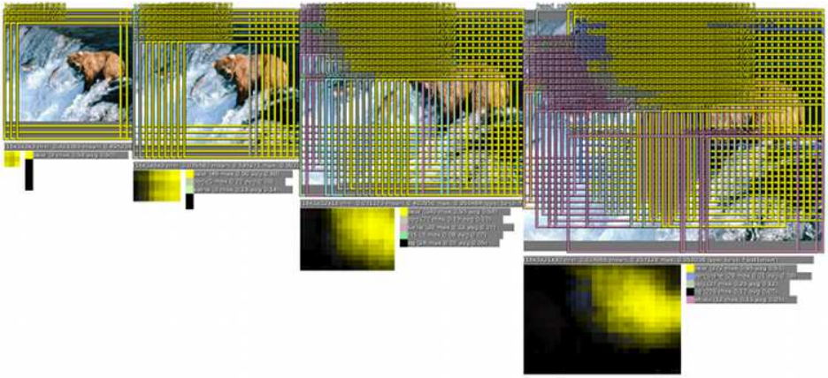
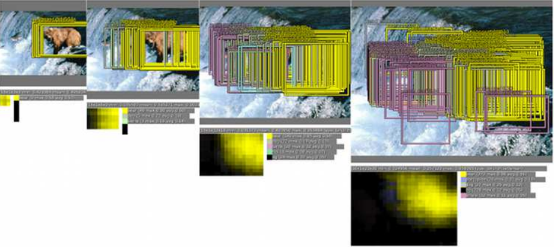
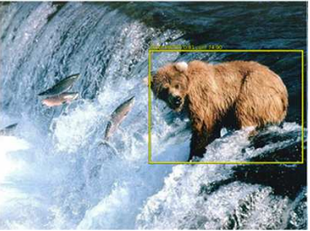
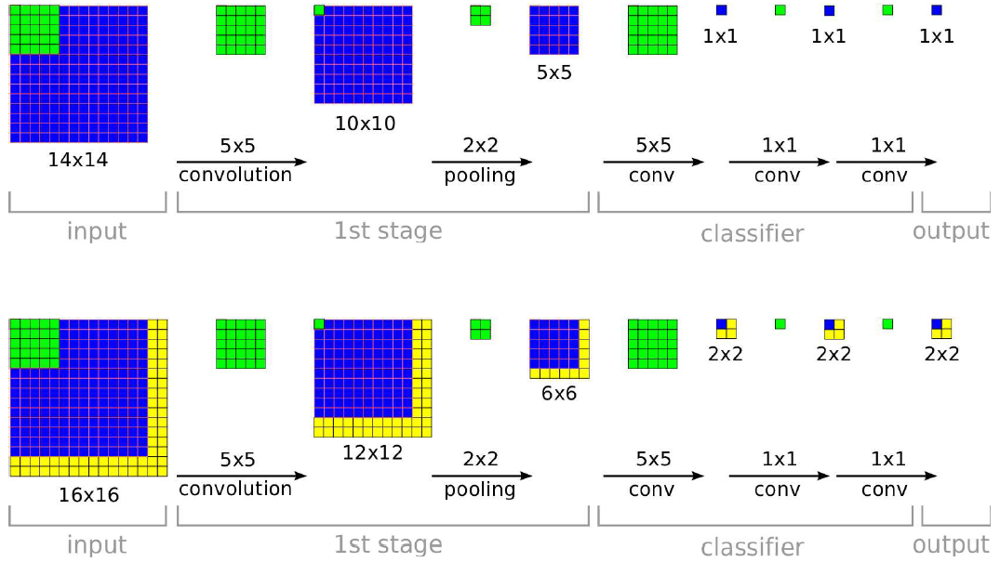

OverFeat是用CNN统一来做分类、定位和检测的经典之作，其作者是深度学习大佬Yann Lecun的纽约大学团队。OverFeat也是ILSVRC 2013任务3（分类+定位）的冠军。

OverFeat的核心思想有三点：

- 区域提名：结合滑动窗口和规则块，即多尺度（Multi-scale）的滑动窗口。
- 分类和定位：统一用CNN来做分类和预测边框位置，模型与AlexNet类似，其中19层为分类层（分类任务专用），不同的任务（分类、定位、检测）公用特征抽取层（19层。
- 聚合：因为用了滑动窗口，同一个目标对象会有多个位置，也就是多个视角；因为用了多尺度，同一个目标对象又会有多个大小不一的块。这些不同位置和不同大小块上的分类置信度会进行累加，从而使得判定更为准确，模型的鲁棒性更好。

## OverFeat步骤

（1）利用滑动窗口进行不同尺度的区域提名，然后利用CNN模型对每个区域进行分类，得到类别和置信度 

（2）利用多尺度滑动窗口来增加检测数量，提升分类效果 

（3）用回归模型预测每个对象的位置，放大比例较大的图片，边框数量也较多 

（4）边框合并 

## OverFeat对CNN高效利用

OverFeat的另一个重要贡献是它的滑动窗口分类回归非常高效，在此之前，很多滑动窗口技术都是为每个窗口重复进行所有的计算，这对计算资源的消耗是巨大的。而OverFeat通过将全连接层改造成卷积层的方式，使得相同区域的计算结果可以共享，如下图所示。

当滑动窗口是14*14，而图片尺寸是16*16时，有4个滑动窗口需要进行重复计算。OverFeat采用了卷积计算共享的方式，虽然计算结果是一个滑动窗口的4倍，但是计算过程只增加了图中黄色区域。在训练期间，ConvNet仅生成单个空间输出（顶部）。但是当在测试时在较大的图像上应用时，它产生空间输出图，例如， 2*2（下）。由于所有层都是卷积应用的，因此较大图像所需的额外计算仅限于黄色区域。为简单起见，此图省略了要素尺寸。

OverFeat是CNN用来进行目标检测的早期工作，主要思想是采用多尺度滑动窗口来做分类、定位和检测，虽然是多个任务，但重用了模型前面几层，这种模型重用的思路也是后来R-CNN系列不断沿用和改进的经典做法。当然，OverFeat也有不少缺点，至少在速度和效果上都有很大的改进空间，后面的R-CNN系列在这两方面做了很多改进。

## Source

[https://github.com/sermanet/OverFeat](https://github.com/sermanet/OverFeat) [https://arxiv.org/abs/1312.6229](https://arxiv.org/abs/1312.6229)
