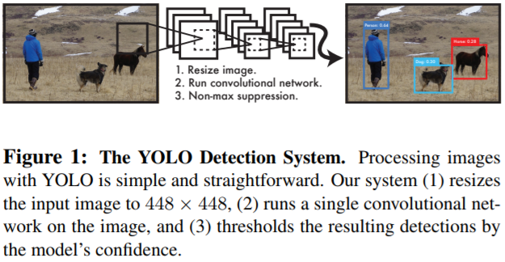
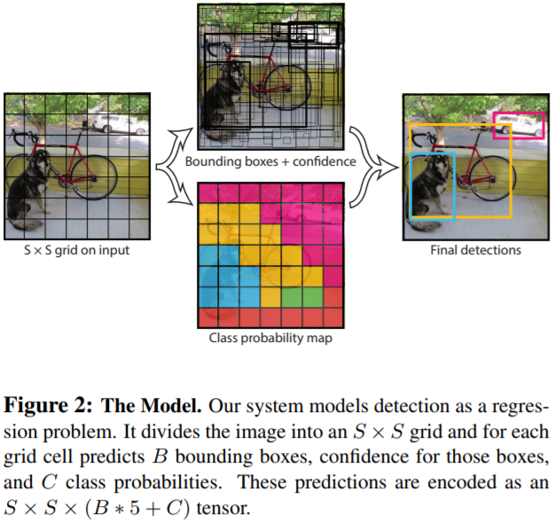

所谓端到端的目标检测方法，这些方法无需区域提名。YOLO的全称是You Only Look Once，顾名思义，就是只看一次，进一步把目标判定和目标识别合二为一，所以识别性能有了很大提升，达到每秒45帧，而在快速版YOLO（Fast YOLO，卷积层更少）中，可以达到每秒155帧。

## YOLO步骤

（1）把输入图片缩放到448*448大小 （2）运行卷积网络 （3）对模型置信度卡阈值，得到目标位置与类别

YOLO网络的模型如上图所示，将448*448大小的图片切成的网格，目标中心点所在的格子负责该目标的相关检测，每个网络预测个边框及其置信度，以及种类别的概率。在YOLO中，，取决于数据集中物体类别数量，比如VOC数据集就是。对VOC数据集来说，YOLO就是把图片统一缩放到448*448，然后每张图平均划分为个小格子，每个格子预测个矩形框及其置信度，以及20种类别的概率。较大的物体可能会由多个网格单元提名，YOLO采用了NMS（Non-Maximum Suppression，非最大抑制）的方法来过滤结果。NMS将mAP提升了2~3个百分点。

YOLO简化了整个目标检测流程，速度的提升也很大，但是YOLO还是有不少可改进的地方，比如的网格就是一个比较启发式的策略，如果两个小目标同时落入一个格子中，模型也只能预测一个；另一个问题是损失函数对不同大小的bbox未做区分。

## Source

[https://pjreddie.com/darknet/yolo/](https://pjreddie.com/darknet/yolo/) [https://github.com/pjreddie/darknet/wiki/YOLO:-Real-Time-Object-Detection](https://github.com/pjreddie/darknet/wiki/YOLO:-Real-Time-Object-Detection) [https://arxiv.org/abs/1506.02640](https://arxiv.org/abs/1506.02640)
