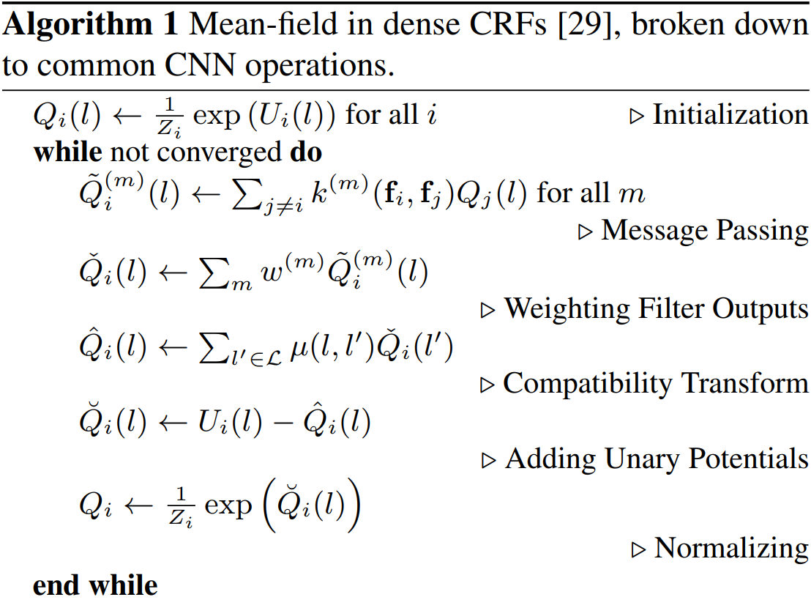
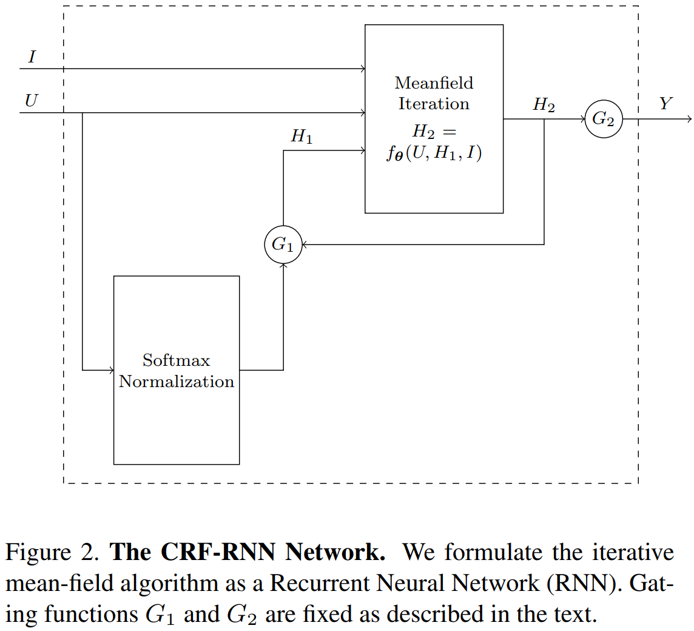

DeepLab使用CRF来袭条语义分割结果，准确率获得了非常大的提升。然而，DeepLab中的深度卷积神经网络和条件随机场相互独立，可以说是在DCNN的结果后面增加了一个独立的概率图模型。DCNN的训练与后面CRF的训练相独立，没有办法获得CRF的信息。由于CRF并没有与DCNN完全融合在一起，CRF的能力还没有得到完全的发挥。而CRFasRNN的贡献在于把CRF建模成深度神经网络的一部分，实现了端到端深度学习的解决方案。首先用CNN来建模CRF的一次迭代，然后用RNN来建模所有迭代。[线上demo](http://www.robots.ox.ac.uk/~szheng/crfasrnndemo)

## CRF建模成CNN网络

与传统的CNN在训练后就确定了参数的做法不同，这里的CNN的系数取决于图片上的原始信息，虽然高斯核的大小跟原始图片一样，但是它只需要很少的参数。CRF的参数如高斯核的权重和标签相容性函数在整个网络的训练中得到了优化，能够进行前向、后向传播。如下图所示，给出了将DenseCRF中的平均场建模为CNN的步骤： 

这里使用来表示前面章节中提到的负的一元势函数。也就是说：

其中表示像素点索引，表示所有可能的标注中的某一个。

第一步：初始化。在每个像素点上对每个标签都做Softmax，其中。这步操作没有任何额外的参数，而且可以很容易地使用CNN中的Softmax来实现前向、后向传播。

第二步：消息传递。在DenseCRF中，信息传递的实现实在值上使用了个高斯核。高斯核的系数由像素位置和RGB值来决定。由于CRF可能是全局关联的，所以每个高斯核的感受野都需要是整张图片的大小。为了使求解过程更快，这里使用了[Permutohedral lattice](https://graphics.stanford.edu/papers/permutohedral/)实现，具体见[文献](https://arxiv.org/abs/1210.5644)。

第三步：高斯核结果加权求和。对每个像素点的每个标签都做一次求和操作，把前一步骤中的每个高斯核的结果做加权求和。单独考虑每个像素点的每个标签，这一项可以看作有个输入通道，一个输出通道的1*1卷积核。

第四步：相容性变换。表示和这两个标签之间的相容性。在以往的工作中，简单地采用了指示函数来实现相容性的计算。当具有相似特征的像素点被赋予不同的标签时，采用了相同的处罚。[CRFasRNN](https://www.robots.ox.ac.uk/~szheng/papers/CRFasRNN.pdf)论文中放宽了这一限制，不同的标签对具有不同的处罚。例如，<“人”，“自行车”>的处罚要比<“天空”，“自行车”>的处罚低。这一步可以看作输入通道和输出通道都是（标签个数）的卷积核大小为1*1的卷积层。这一步就是在学习标签之间的相容性函数。

第五步：增加一元势函数。这一步没有额外的参数。

第六步：标准化。采用一个Softmax函数实现。

## CRF迭代建模RNN

在成功地将CRF的一次迭代建模成CNN网络之后，需要解决的是如何将CRF的多次迭代建模成RNN网络。如下图所示，用表示一次平均场迭代做的变换，其输入是图片，pixel-wise的一维概率值为，前一次的迭代的边缘分布估计为，输出是下一次迭代的边缘分布。多次平均迭代可以将上述的进行迭代，使用上一次迭代的和原始的作为输入。

网络的行为可以用如下一组公式来表示：

  

[文献](https://arxiv.org/abs/1210.5644)中提到，平均场迭代不超过10次就可以收敛，在实际使用中，超过5词迭代之后，继续迭代，就不能显著地提高效果了。所以在这个问题上，并不会遇到梯度消失或梯度爆炸的问题。因此这里采用了更简洁的RNN结构，并没有采用诸如LSTM之类的结构。
