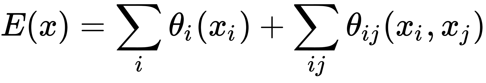
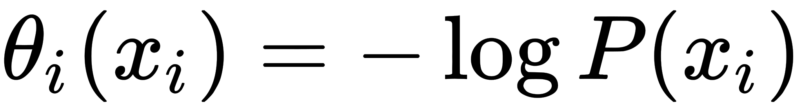
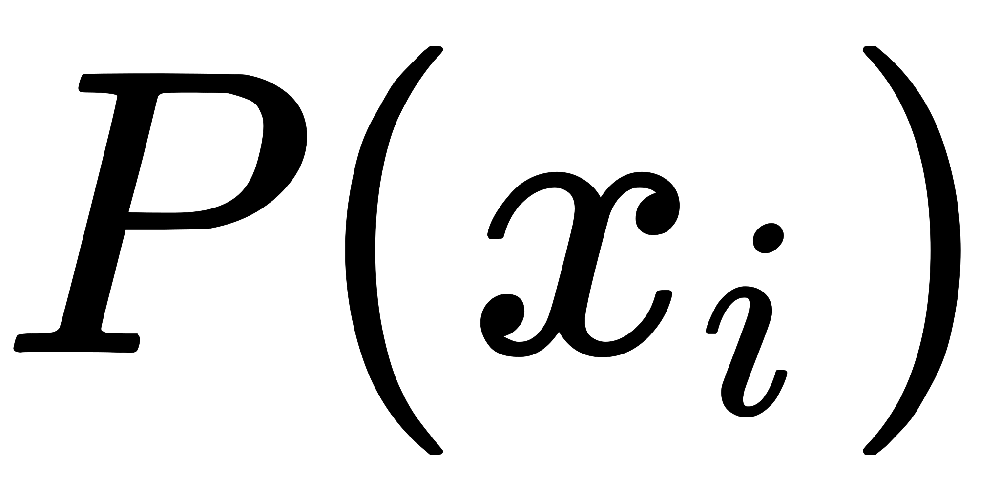
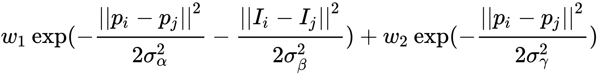
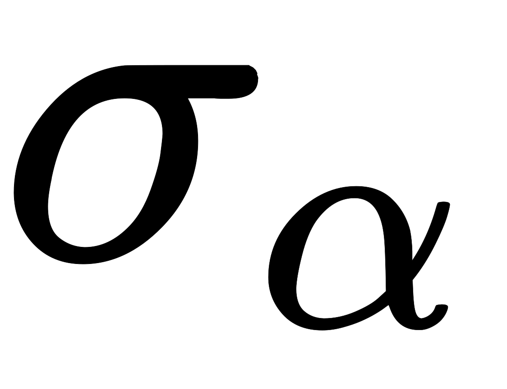
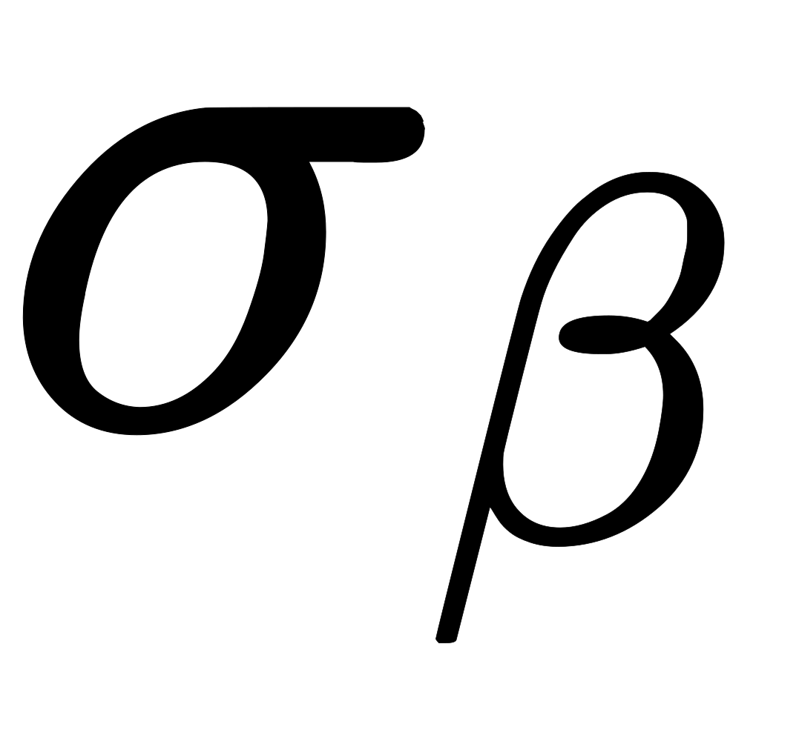
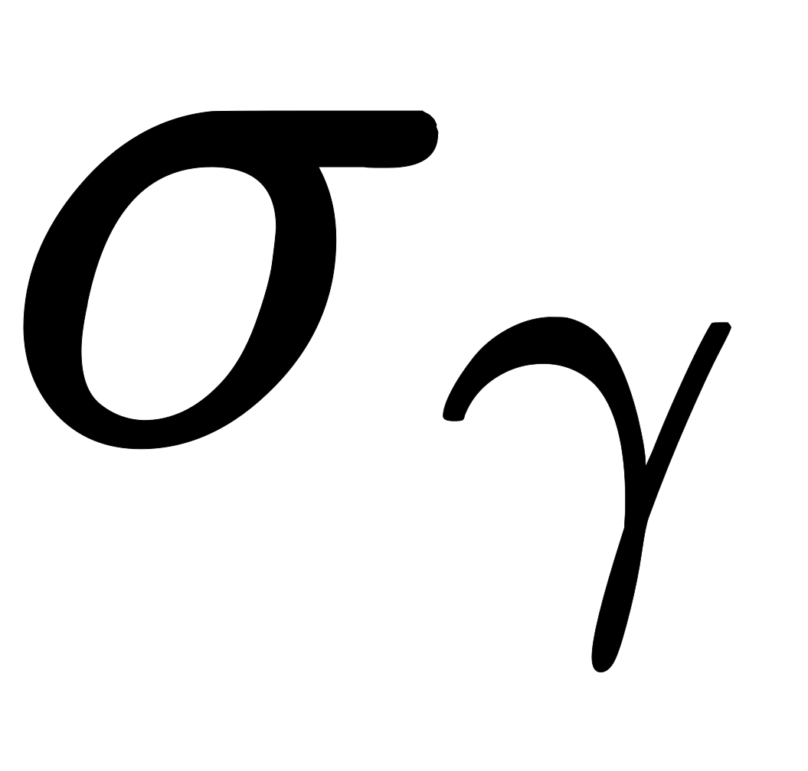
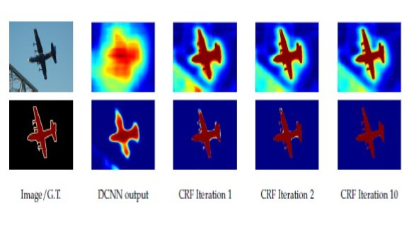

对于精准的目标分割来说，DCNN（Deep Convolutional Neural Network）的最后一层的细节不够充分，这是由DCNN的不变性决定的。DCNN的不变性使它在高层任务（图片分类、目标检测）上表现的很好。然而，把DCNN直接用于语义分割，需要克服两个方面的缺点：一是信号降采样；而是空间不变性。

- 降采样是由池化层和卷积层里的步长带来的，DeepLab为了克服降采样的缺点，先于DilatedConvNet采用了空洞卷积，但是它保留了池化层。
- 第二个问题则是由以获取目标来做决策的分类问题跟与空间信息相关的分割问题的矛盾引发的。DeepLab为了解决第二个问题，采用了条件随机场[DenseCRF](https://arxiv.org/abs/1210.5644)。之所以使用DenseCRF，是由于它不仅运算速度快，而且既保留了细节，又能获得长距离的依赖关系。

可以说，DeepLab的贡献在于结合了深度卷积神经网络和概率图模型这两大机器学习方法。

DCNN的得分映射（Score Map，Softmax层的输入）能够预测物体的大概位置，但是边界定位得不够好。卷积层天然使得在分类准确性和定位准确性之间存在取舍：在分类网络中，具有多个池化层的更深的模型在分类问题上更准确，但是它的位置无关性和更大的感受野使得在得分映射上计算准确位置更难。

传统的CRF使用能量函数来建模相邻节点，使相近的像素点更倾向于相同分类。这与图像语义分割的目标不同：得分映射已经非常平滑，相近的像素点已经具有同质化的分类。在这种情况下，使用短距离的CRF可能会有害。语义分割的目标是还原细节，但不是一步平滑。所以DeepLab采用了长距离CRF，模型的能量函数如下：

其中是像素点的分类。一元势函数来自前端的输出：

其中是DCNN计算出来的在像素点的分类概率。第二项是二元势函数，当，两点的分类相同时，此项取值是。整张图片上的任意两点间都存在二元势函数，而不论这两点距离有多远。二元势函数定义如下：

其中表示位置，表示颜色。第一个核与位置和颜色相关。第二个核只与位置相关。超参数，，控制了高斯核的方差。第一个高斯核使得相近颜色的相邻像素点更容易拥有同样的分类。第二个高斯核只考虑了相邻像素点之间的平滑度。下图显示了CRF在描绘细节方面的能力。

DeepLab还使用了多尺度预测的方法，在输入图片和前四个池化层的输出后都增加两层感知机（第一层是128个3*3的卷积层，第二层是128个1*1的卷积层），然后与主网络的最后一个层的特征图并列，所以Softmax层的输入增加了5*128=640个通道。训练时，保持主网络的旧参数不变，只更新新增的参数。

DeepLab使用CRF后，提成4%；使用多尺度特征后，提升1.5%；既使用多尺度又使用CRF后，提升5.4%。
