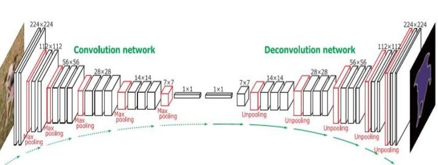
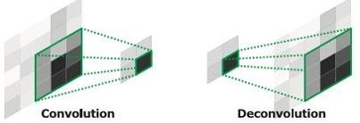
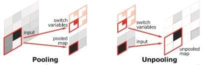

在FCN发表半年后的ICCV 2015上，DeconvNet针对FCN的部分缺点做了优化，使用反卷积和Unpooling来弥补FCN规定了维度的缺点。其全局的网络结构如下图：

卷积神经网络中的池化层用于从一定的感受野中过滤噪声，提取单一特征，这在分类问题中非常有效。但是在语义分割问题中，细节同样重要，所以Unpooling操作非常有效。Unpooling与池化层相对应，池化层记录好每个结果对应的来源（下标）传递给Unpooling层，如下图所示（绿）。下图（红）示意了反卷积操作，尽管看起来反卷积操作将特征图扩大了，但是DeconvNet中的反卷积层保持特征图不变。特征图增大是通过Unpooling来实现的

 

与FCN相比，这种结构化的反卷积能够获得不同层次的形状和细节，弥补了FCN在特大或特小物体语义分割上的缺陷。DeconvNet也同样遇到了网络结构复杂、训练样本少的问题。为了解决这个问题，DeconvNet在每个卷积层和反卷积层增加了Batch Normalization。DeconvNet还采用了分段训练的方式，先使用简单的样本训练网络，然后再使用复杂的样本微调网络。为了获得简单的训练样本，先裁剪图片，使得目标物体位于图片中央。在推断时，采用了区域提名的技术来辅助，将多个区域的结果合并作为最终结果呈现。
