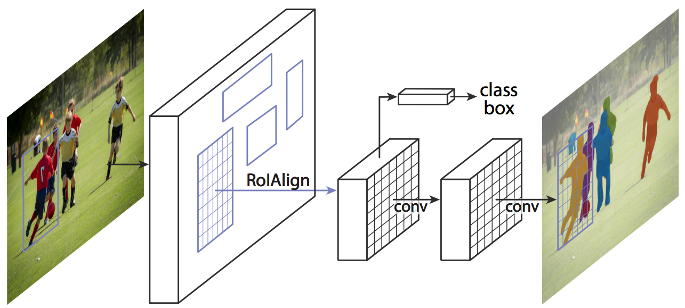

Mask R-CNN在Faster R-CNN的基础上，额外增加了一个分支来预测目标的掩码。Mask R-CNN的框架如下图所示： 

在Faster R-CNN的基础上，Mask R-CNN做了如下改进：

- 在每个RoI上都增加了一个分支，能够在预测分类和边框的同时，使用一个很小的全卷积网络来获得到掩码。整个网络的损失由三部分构成：分类损失、边框损失和掩码损失。在FCN中，为每个像素点进行多个分类之间的Softmax运算，不同类之间存在竞争关系。然而，在Mask R-CNN中，为每个分类都会生成一份掩码，不同类之间没有竞争关系。
- 使用RoIAlign代替RoIPool。在Faster R-CNN中使用RoIPool把RoI的浮点数量化为整数，这个量化使RoIPool的结果与真是的特征图谱之间存在误差。为了解决这个问题，RoIAlign使用了双线性插值来表示精确的RoI。
- 使用了FPN（Feature Pyramid Network）来获取不同维度的特征。
