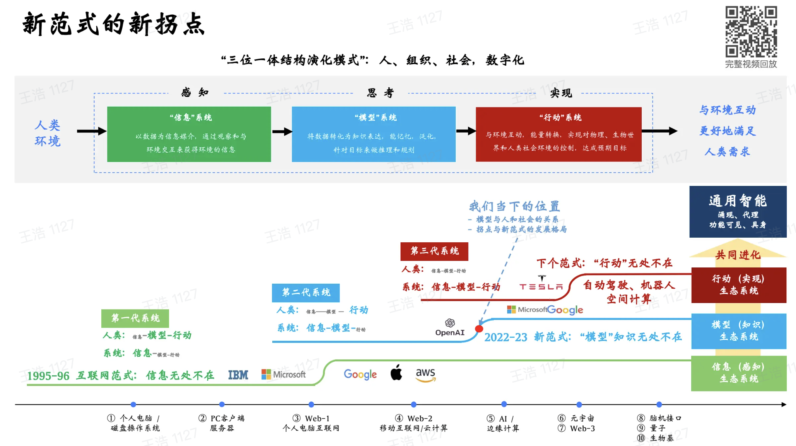
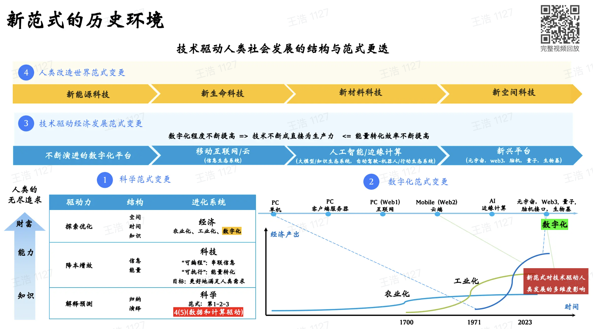
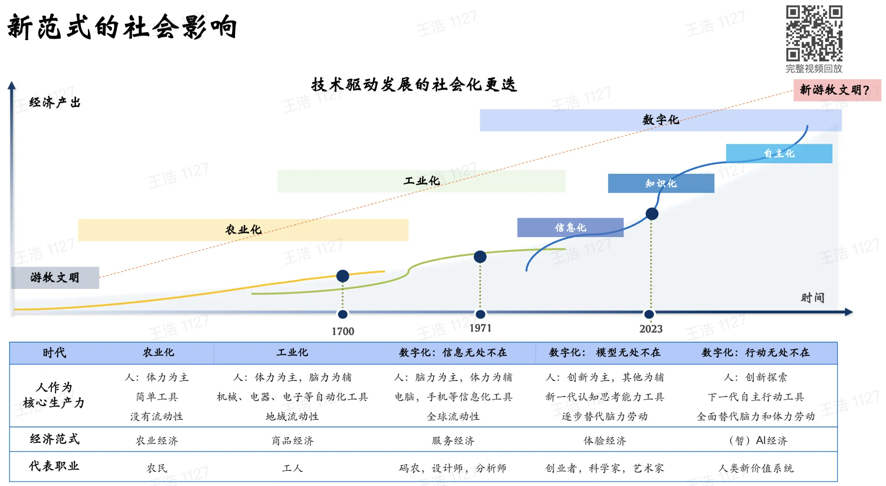

通用人工智能（Artificial General Intelligence, AGI）是具有一般人类智慧，可以执行人类能够执行的任何智力任务的机器智能。通用人工智能是一些人工智能研究的主要目标，也是科幻小说和未来研究中的共同话题。一些研究人员将通用人工智能称为强AI（strong AI）或者完全AI（full AI），或称机器具有执行通用智能行为（general intelligent action）的能力。与弱AI（weak AI）相比，强AI可以尝试执行全方位的人类认知能力。

# 人工智能定义
人们提出过很多人工智能的定义（例如能够通过图灵测试），但是没有一个定义能够得到所有人的认同；然而，人工智能的研究者们普遍同意，以下特质是一个智能所必须要拥有的：

- 自动推理，使用一些策略来解决问题，在不确定性的环境中作出决策；
- 知识表示，包括常识知识库；
- 自动规划；
- 自主学习、创新；
- 使用自然语言进行沟通；
- 以及，集成以上这些手段来达到同一个的目标；

还有一些重要的能力，包括机器知觉（例如计算机视觉），以及在智能行为的世界中行动的能力（例如机器人移动自身和其他物体的能力）。它可能包括探知与回避危险的能力。许多研究智能的交叉领域（例如认知科学、机器智能和决策）试图强调一些额外的特征，例如想象力（不依靠预设而建构精神影像与概念的能力）以及自主性。基于计算机的系统中的确已经存在许多这样的能力，例如计算创造性、自动推理、决策支持系统、机器人、进化计算、智能代理，然而并未达到人类的水平。

## 测试标准
一个强人工智能需要通过什么样的测试标准，科学家们有很多不同的想法，他们之中包括阿兰·图灵、本·格策尔、尼尔斯·尼尔森，他们提出的测试包括：

- 图灵测试（图灵）：如果一个人（代号C）使用测试对象皆理解的语言去询问两个他不能看见的对象任意一串问题。对象为：一个是正常思维的人（代号B）、一个是机器（代号A）。如果经过若干询问以后，C不能得出实质的区别来分辨A与B的不同，则此机器A通过图灵测试。
- 咖啡测试 (沃兹尼亚克)：生活中空间、操作技能的测试。将一部机器带到任何一个普通的美国家庭中，让它在不经刻意设计的条件下，懂得泡好一杯咖啡。它需要主动在陌生空间中认识咖啡机、识别咖啡和水、找到合适的杯子并放好，然后按正确的键和操作以冲泡咖啡。这需要仰赖机器人学、图像识别的演算。
- 机器人学生测试 (格策尔)：透过机器学习，分析和回答单一问题的测试 。让一个机器去注册一所大学，参加和人类学生同样的考试，然后通过并获得学位。例如日本的东大AI或是IBM参加抢答节目的沃森。
- 雇员测试 (尼尔森)：测试统筹、推断、发想、规划解决复杂问题的能力。让机器处在一个经济上重要的职位，需要它能够和同样职位的人类做得同样好或者更好。

# 时代演进
  

# Source
[https://zh.wikipedia.org/wiki/%E9%80%9A%E7%94%A8%E4%BA%BA%E5%B7%A5%E6%99%BA%E6%85%A7](https://zh.wikipedia.org/wiki/%E9%80%9A%E7%94%A8%E4%BA%BA%E5%B7%A5%E6%99%BA%E6%85%A7) [通用人工智能](https://www.jiqizhixin.com/graph/technologies/f1ce4161-b3c6-4b8a-b777-2d7958fe8b89) [https://miracleplus.feishu.cn/file/TGKRbW4yrosqmixCtprcUlAynzg](https://miracleplus.feishu.cn/file/TGKRbW4yrosqmixCtprcUlAynzg)
