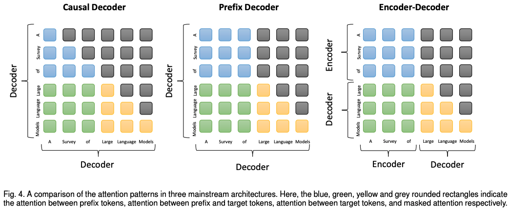
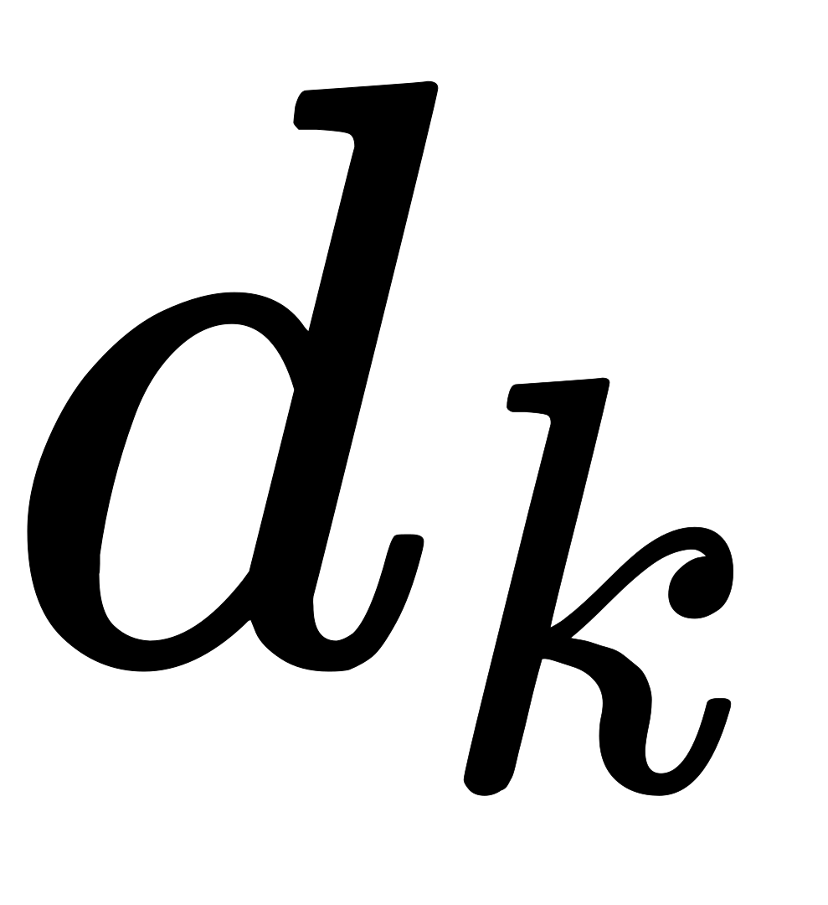
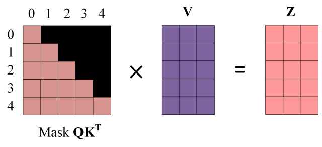

 架构各种探索主要分为Encoder-Decoder、Encoder-Only和Decoder-Only，如上图所示。现在大语言模型的主流架构大致分为三种类型，即因果解码器(Causal Decoder)、前缀解码器(Prefix Decoder)、编码器-解码器(Encoder-Decoder)：

- 因果解码器(Causal Decoder)：因果解码器架构采用单向注意力掩码，以确保每个输入标记只能关注过去的标记和它本身。输入和输出标记通过解码器以相同的方式进行处理。
- 前缀解码器(Prefix Decoder)：前缀解码器结构修正了因果编码器的掩码机制，以使其能可对前缀标记执行双向注意力，并仅对生成的标记执行单向注意力。这样，与encoder-decoder类似，可以双向编码前缀序列并自回归低逐个预测输出标记，其中在编码和解码阶段共享相同的参数。
- 编码器-解码器(encoder-decoder)：传统 Transformer 模型是建立在编码器-解码器架构上的，由两个 Transformer 块分别作为编码器和解码器。编码器采用堆叠的多头自注意层对输入序列进行编码以生成其潜在表示，而解码器对这些表示进行交叉注意并自回归地生成目标序列。

 Decoder-only都是指因果解码器(Causal Decoder)，主要优点是没有降秩问题。Prefix Decoder只有U-PaLM和GLM，U-PaLM是在Causal Decoder PaLM的基础上微调成Prefix，纯正的PLM Prefix Decoder只有清华GLM，因为双向，就会降秩。Causal Decoder是绝对主流，Prefix Decoder和Encoder-Decoder也有不错表现。Encoder-only近年来没有更新进展主要是和主流方向不太相符。

# Encoder-Decoder
Encoder-Decoder结构是RNN最重要的一个变种，有多种称呼，比如Seq2Seq，Transfoer，Encoder-Decoder，Nvs.M的RNN等，具体可参见我之前的[深度学习-RNN-循环神经网络](https://www.yuque.com/angsweet/machine-learning/shen-du-xue-xi_shen-du-xue-xi_xun-huan-he-di-gui-wang-luo_xun-huan-shen-jing-wang-luo)章节。Encoder和Decoder结构是在[Attention Is All You Need](https://arxiv.org/abs/1706.03762)论文中被阐述，后续被广泛应用。   

## Attention
我在[深度学习-解析-Attention](https://www.yuque.com/angsweet/machine-learning/shen-du-xue-xi_shen-du-xue-xi_ji-shu-fen-xi_attention)章节有详细全面的介绍Attention，想全面掌握的可以跳转学习，这里仅再一次论述selft-attention相关。下图是论文中 Transformer 的内部结构图，左侧为 Encoder block，右侧为 Decoder block。红色圈中的部分为 Multi-Head Attention，是由多个 Self-Attention组成的，可以看到 Encoder block 包含一个 Multi-Head Attention，而 Decoder block 包含两个 Multi-Head Attention (其中有一个用到 Masked)。Multi-Head Attention 上方还包括一个 Add & Norm 层，Add 表示残差连接 (Residual Connection) 用于防止网络退化，Norm 表示 Layer Normalization，用于对每一层的激活值进行归一化。  因为 Self-Attention是 Transformer 的重点，所以我们重点关注 Multi-Head Attention 以及 Self-Attention，首先详细了解一下 Self-Attention 的内部逻辑。 

### Self-Attention
下图是 Self-Attention 的结构，在计算的时候需要用到矩阵(查询)，(键值)，(值)。在实际中，Self-Attention 接收的是输入(单词的表示向量组成的矩阵) 或者上一个 Encoder block 的输出。而，，正是通过 Self-Attention 的输入进行线性变换得到的。  Self Attention也是在Scaled Dot-Product Attention单元里面实现的，如上图左图所示，首先把输入Input经过线性变换分别得到，，，注意，，，都来自于Input，只不过是线性变换的矩阵的权值不同而已。然后把和做dot Product相乘，得到输入Input词与词之间的依赖关系，然后经过尺度变换(scale)、掩码(mask)和softmax操作，得到最终的Self Attention矩阵。尺度变换是为了防止输入值过大导致训练不稳定，mask则是为了保证时间的先后关系。最后，把encoder端self Attention计算的结果加入到decoder做为和，结合decoder自身的输出做为，得到encoder端的attention与decoder端attention之间的依赖关系

下面细讲Self Attention，(Query)，(Key)，(Value)三个矩阵均来自同一输入，首先我们要计算和之间的点乘，然后为了防止其结果过大，会除以一个尺度标度，其中为一个query和key向量的维度。再利用Softmax操作将其结果归一化为概率分布，然后再乘以矩阵V就得到权重求和的表示。该操作可以表示为  这里可能比较抽象，我们来看一个具体的例子（图片来源于[The Illustrated Transformer](https://jalammar.github.io/illustrated-transformer/)，，该博客讲解的极其清晰，强烈推荐）假如我们要翻译一个词组Thinking Machines，其中Thinking的输入的embedding vector用表示，Machines的embedding vector用表示。  当我们处理Thinking这个词时，我们需要计算句子中所有词与它的Attention Score，这就像将当前词作为搜索的query，去和句子中所有词（包含该词本身）的key去匹配，看看相关度有多高。我们用代表Thinking对应的query vector，及分别代表Thinking以及Machines对应的key vector，则计算Thinking的attention score的时候我们需要计算与，的点乘，同理，我们计算Machines的attention score的时候需要计算与，的点乘。如上图中所示我们分别得到了与，的点乘积，然后我们进行尺度缩放与softmax归一化，如下图所示：  显然，当前单词与其自身的attention score一般最大，其他单词根据与当前单词重要程度有相应的score。然后我们在用这些attention score与value vector相乘，得到加权的向量。  如果将输入的所有向量合并为矩阵形式，则所有query, key, value向量也可以合并为矩阵形式表示  乘以的转置后，得到的矩阵行列数都为，为句子单词数，这个矩阵可以表示单词之间的 attention 强度。下图为乘以，表示的是句子中的单词  得到之后，使用 Softmax 计算每一个单词对于其他单词的 attention 系数，公式中的 Softmax 是对矩阵的每一行进行 Softmax，即每一行的和都变为1  得到 Softmax 矩阵之后可以和相乘，得到最终的输出  上图中 Softmax 矩阵的第行表示单词与其他所有单词的 attention 系数，最终单词的输出等于所有单词的值根据 attention 系数的比例加在一起得到，如下图所示 

### Multi-Head Attention
在上一步，我们已经知道怎么通过 Self-Attention 计算得到输出矩阵 Z，而 Multi-Head Attention 是由多个 Self-Attention 组合形成的，下图是论文中 Multi-Head Attention 的结构图。  其中，，是我们模型训练过程学习到的合适的参数。上述操作即可简化为矩阵形式  依此类推，multihead就是我们可以有不同的，，表示，最后再将其结果结合起来，如下图所示： 

## Encoder
 上图红色部分是 Transformer 的 Encoder block 结构，可以看到是由 Multi-Head Attention, Add & Norm, Feed Forward, Add & Norm 组成的。刚刚已经了解了 Multi-Head Attention 的计算过程，现在了解一下 Add & Norm 和 Feed Forward 部分

### Add&Norm
Add & Norm 层由 Add 和 Norm 两部分组成，其计算公式如下：  其中 X表示 Multi-Head Attention 或者 Feed Forward 的输入，Multi-Head Attention() 和 Feed Forward() 表示输出 (输出与输入维度是一样的，所以可以相加)

Add指 + Multi-Head Attention()，是一种残差连接，通常用于解决多层网络训练的问题，可以让网络只关注当前差异的部分，在 ResNet 中经常用到：  Norm指 Layer Normalization，通常用于 RNN 结构，Layer Normalization 会将每一层神经元的输入都转成均值方差都一样的，这样可以加快收敛。

### Feed Forward
Feed Forward 层比较简单，是一个两层的全连接层，第一层的激活函数为 Relu，第二层不使用激活函数，对应的公式如下。  是输入，Feed Forward 最终得到的输出矩阵的维度与一致。

### 组成Encoder
通过上面描述的 Multi-Head Attention, Feed Forward, Add & Norm 就可以构造出一个 Encoder block，Encoder block 接收输入矩阵，并输出一个矩阵。通过多个 Encoder block 叠加就可以组成 Encoder。

第一个 Encoder block 的输入为句子单词的表示向量矩阵，后续 Encoder block 的输入是前一个 Encoder block 的输出，最后一个 Encoder block 输出的矩阵就是编码信息矩阵，这一矩阵后续会用到 Decoder 中 

## Decoder
 上图红色部分为 Transformer 的 Decoder block 结构，与 Encoder block 相似，但是存在一些区别：

- 包含两个 Multi-Head Attention 层
- 第一个 Multi-Head Attention 层采用了 Masked 操作
- 第二个 Multi-Head Attention 层的，矩阵使用 Encoder 的编码信息矩阵进行计算，而使用上一个 Decoder block 的输出计算
- 最后有一个 Softmax 层计算下一个翻译单词的概率

### 第一个Multi-Head Attention
Decoder block 的第一个 Multi-Head Attention 采用了 Masked 操作，因为在翻译的过程中是顺序翻译的，即翻译完第个单词，才可以翻译第个单词。通过 Masked 操作可以防止第个单词知道个单词之后的信息。下面以 "我有一只猫" 翻译成 "I have a cat" 为例，了解一下 Masked 操作。

下面的描述中使用了类似 Teacher Forcing 的概念，不熟悉 Teacher Forcing 的童鞋可以参考以下上一篇文章Seq2Seq 模型详解。在 Decoder 的时候，是需要根据之前的翻译，求解当前最有可能的翻译，如下图所示。首先根据输入 "<Begin>" 预测出第一个单词为 "I"，然后根据输入 "<Begin> I" 预测下一个单词 "have"。  Decoder 可以在训练的过程中使用 Teacher Forcing 并且并行化训练，即将正确的单词序列 (<Begin> I have a cat) 和对应输出 (I have a cat <end>) 传递到 Decoder。那么在预测第个输出时，就要将第之后的单词掩盖住，注意 Mask 操作是在 Self-Attention 的 Softmax 之前使用的，下面用分别表示 "<Begin> I have a cat <end>"。

**第一步：**是 Decoder 的输入矩阵和 Mask 矩阵，输入矩阵包含 "<Begin> I have a cat" () 五个单词的表示向量，Mask 是一个的矩阵。在 Mask 可以发现单词只能使用单词的信息，而单词可以使用单词的信息，即只能使用之前的信息  **第二步：**接下来的操作和之前的 Self-Attention 一样，通过输入矩阵X计算得到矩阵。然后计算和的乘积  **第三步：**在得到之后需要进行 Softmax，计算 attention score，我们在 Softmax 之前需要使用Mask矩阵遮挡住每一个单词之后的信息，遮挡操作如下：  得到 Mask 之后在 Mask 上进行 Softmax，每一行的和都为。但是单词在单词上的 attention score 都为 **第四步：**使用 Mask 与矩阵相乘，得到输出，则单词的输出向量 是只包含单词信息  第五步：通过上述步骤就可以得到一个 Mask Self-Attention 的输出矩阵，然后和 Encoder 类似，通过 Multi-Head Attention 拼接多个输出然后计算得到第一个 Multi-Head Attention 的输出，与输入维度一样

### 第二个Multi-Head Attention
Decoder block 第二个 Multi-Head Attention 变化不大， 主要的区别在于其中 Self-Attention 的，矩阵不是使用 上一个 Decoder block 的输出计算的，而是使用 Encoder 的编码信息矩阵计算的。

根据 Encoder 的输出计算得到，，根据上一个 Decoder block 的输出计算(如果是第一个 Decoder block 则使用输入矩阵进行计算)，后续的计算方法与之前描述的一致。

这样做的好处是在 Decoder 的时候，每一位单词都可以利用到 Encoder 所有单词的信息 (这些信息无需 Mask)。

### Softmax预测输出单词
Decoder block 最后的部分是利用 Softmax 预测下一个单词，在之前的网络层我们可以得到一个最终的输出，因为 Mask 的存在，使得单词的输出只包含单词的信息，如下：  Softmax 根据输出矩阵的每一行预测下一个单词：  这就是 Decoder block 的定义，与 Encoder 一样，Decoder 是由多个 Decoder block 组合而成。

# BERT-style语言模型: Encoder-Decoder or Encoder-only
| 模型 | 论文链接 |
| --- | --- |
| BERT | [BERT: Pre-training of Deep Bidirectional Transformers for Language Understanding. 2018](https://aclanthology.org/N19-1423.pdf) |
| RoBERTa | [RoBERTa: A Robustly Optimized BERT Pretraining Approach. 2019](https://arxiv.org/abs/1907.11692) |
| DistilBERT | [DistilBERT, a distilled version of BERT: smaller, faster, cheaper and lighter. 2019](https://arxiv.org/abs/1910.01108) |
| ALBERT | [ALBERT: A Lite BERT for Self-supervised Learning of Language Representations. 2019](https://arxiv.org/abs/1909.11942) |
| UniLM | [Unified Language Model Pre-training for Natural Language Understanding and Generation. 2019](https://arxiv.org/abs/1905.03197) |
| ELECTRA | [ELECTRA: PRE-TRAINING TEXT ENCODERS AS DISCRIMINATORS RATHER THAN GENERATORS. 2020](https://openreview.net/pdf?id=r1xMH1BtvB) |
| T5 | [Exploring the Limits of Transfer Learning with a Unified Text-to-Text Transformer. 2019](https://arxiv.org/abs/1910.10683) |
| GLM | [GLM-130B: An Open Bilingual Pre-trained Model. 2022](https://arxiv.org/abs/2210.02414) |
| AlexaTM | [AlexaTM 20B: Few-Shot Learning Using a Large-Scale Multilingual Seq2Seq Model. 2022](https://arxiv.org/abs/2208.01448) |
| ST-MoE | [ST-MoE: Designing Stable and Transferable Sparse Expert Models. 2022](https://arxiv.org/abs/2202.08906) |

# GPT-style语言模型: Decoder-only
| 模型 | 论文链接 |
| --- | --- |
| GPT | [Improving Language Understanding by Generative Pre-Training. 2018](https://s3-us-west-2.amazonaws.com/openai-assets/research-covers/language-unsupervised/language_understanding_paper.pdf) |
| GPT-2 | [Language Models are Unsupervised Multitask Learners. 2018](https://d4mucfpksywv.cloudfront.net/better-language-models/language_models_are_unsupervised_multitask_learners.pdf) |
| GPT-3 | [Language Models are Few-Shot Learners. 2020](https://arxiv.org/abs/2005.14165) |
| OPT | [OPT: Open Pre-trained Transformer Language Models](https://arxiv.org/abs/2205.01068) |
| PaLM | [PaLM: Scaling Language Modeling with Pathways. 2022](https://arxiv.org/abs/2204.02311) |
| BLOOM | [BLOOM: A 176B-Parameter Open-Access Multilingual Language Model. 2022](https://arxiv.org/abs/2211.05100) |
| MT-NLG | [Using DeepSpeed and Megatron to Train Megatron-Turing NLG 530B, A Large-Scale Generative Language Model. 2021](https://arxiv.org/abs/2201.11990) |
| GLaM | [GLaM: Efficient Scaling of Language Models with Mixture-of-Experts. 2022](https://arxiv.org/abs/2112.06905) |
| Gopher | [Scaling Language Models: Methods, Analysis & Insights from Training Gopher. 2021](http://arxiv.org/abs/2112.11446v2) |
| chinchilla | [Training Compute-Optimal Large Language Models. 2022](https://arxiv.org/abs/2203.15556) |
| LaMDA | [LaMDA: Language Models for Dialog Applications. 2021](https://arxiv.org/abs/2201.08239) |
| LLaMA | [LLaMA: Open and Efficient Foundation Language Models. 2023](https://arxiv.org/abs/2302.13971v1) |
| GPT-4 | [GPT-4 Technical Report. 2023](http://arxiv.org/abs/2303.08774v2) |
| BloombergGPT | [BloombergGPT: A Large Language Model for Finance. 2023](https://arxiv.org/abs/2303.17564) |
| GPT-NeoX-20B | [GPT-NeoX-20B: An Open-Source Autoregressive Language Model. 2022](https://arxiv.org/abs/2204.06745) |

# Source
[The Illustrated Transformer](https://jalammar.github.io/illustrated-transformer/) [完全图解RNN、RNN变体、Seq2Seq、Attention机制](https://zhuanlan.zhihu.com/p/28054589) [Transformer模型详解（图解最完整版）](https://zhuanlan.zhihu.com/p/338817680) [GitHub - Mooler0410/LLMsPracticalGuide: A curated list of practical guide resources of LLMs (LLMs Tree, Examples, Papers)](https://github.com/Mooler0410/LLMsPracticalGuide) [GitHub - RUCAIBox/LLMSurvey: The official GitHub page for the survey paper “A Survey of Large Language Models”.](https://github.com/RUCAIBox/LLMSurvey) [Attention Is All You Need](https://arxiv.org/abs/1706.03762) [https://arxiv.org/pdf/2304.13712.pdf](https://arxiv.org/pdf/2304.13712.pdf) [https://arxiv.org/pdf/2303.18223.pdf](https://arxiv.org/pdf/2303.18223.pdf) [https://arxiv.org/pdf/2204.05832.pdf](https://arxiv.org/pdf/2204.05832.pdf) [从Word Embedding到Bert模型—自然语言处理中的预训练技术发展史](https://zhuanlan.zhihu.com/p/49271699) [乘风破浪的PTM：两年来预训练模型的技术进展](https://zhuanlan.zhihu.com/p/254821426) [通向AGI之路：大型语言模型（LLM）技术精要](https://zhuanlan.zhihu.com/p/597586623)

