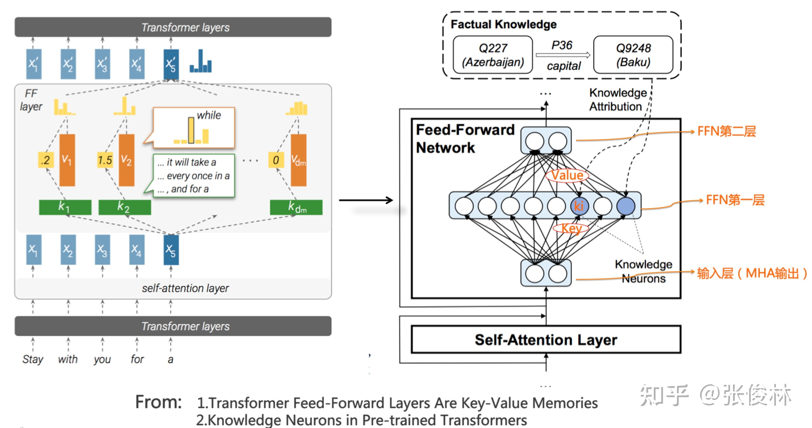
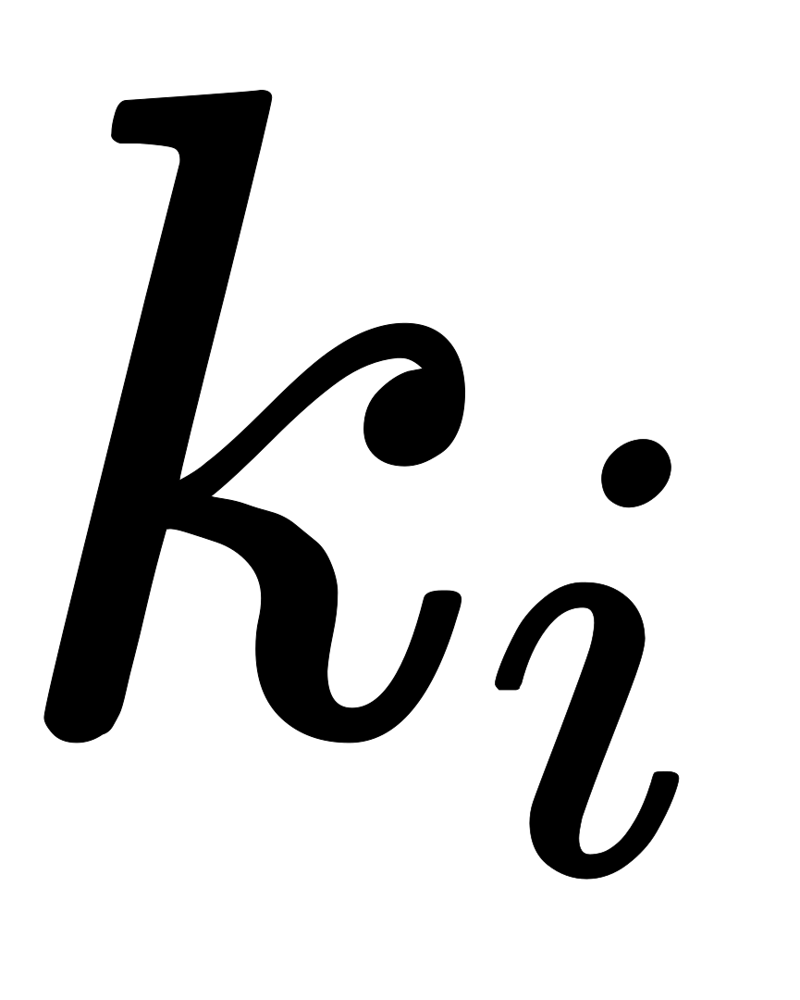
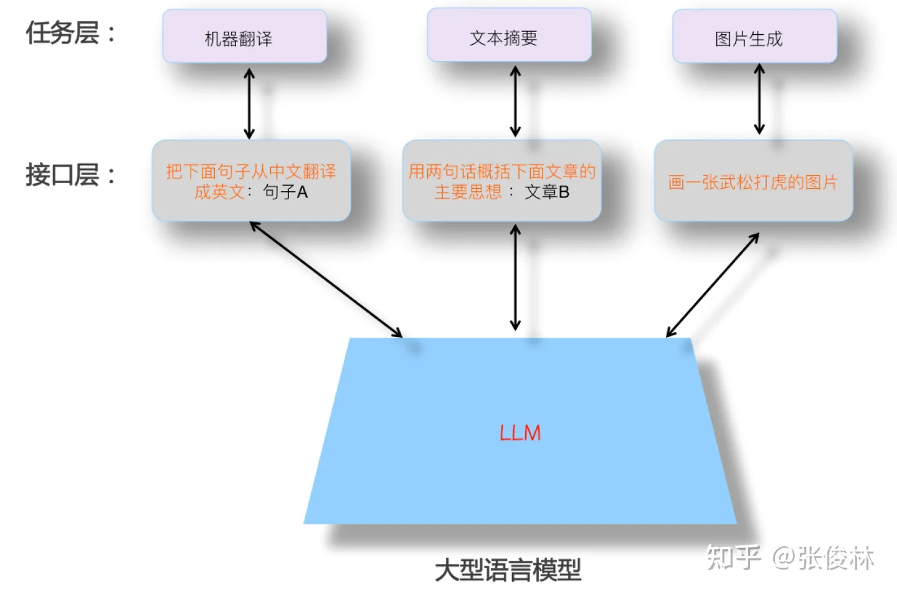

# 知识数据
从目前研究结果看，Transformer是足够强大的特征抽取器，尚不需要做特别的改进。那么通过预训练过程，Transformer学到了什么？知识是如何存取的？我们又如何修正错误知识？

## 知识类型
LLM从海量自由文本中学习了大量知识，若把这些知识做粗略分类的话，可分为语言类知识和世界知识两大类： **语言知识：**语言类知识指的是词法、词性、句法、语义等有助于人类或机器理解自然语言的知识。关于LLM能否捕获语言知识有较长研究历史，自从Bert出现以来就不断有相关研究，很早就有结论，各种实验充分证明LLM可以学习各种层次类型的语言学知识，这也是为何使用预训练模型后，各种语言理解类自然语言任务获得大幅效果提升的最重要原因之一。另外，各种研究也证明了浅层语言知识比如词法、词性、句法等知识存储在Transformer的低层和中层，而抽象的语言知识比如语义类知识，广泛分布在Transformer的中层和高层结构中。 **世界知识：**世界知识指的是在这个世界上发生的一些真实事件（事实型知识，Factual Knowledge），以及一些常识性知识(Common Sense Knowledge)。比如“拜登是现任美国总统”、“拜登是美国人”、“乌克兰总统泽连斯基与美国总统拜登举行会晤”，这些都是和拜登相关的事实类知识；而“人有两只眼睛”、“太阳从东方升起”这些属于常识性知识。关于LLM模型能否学习世界知识的研究也有很多，结论也比较一致：LLM确实从训练数据中吸收了大量世界知识，而这类知识主要分布在Transformer的中层和高层，尤其聚集在中层。而且，随着Transformer模型层深增加，能够学习到的知识数量逐渐以指数级增加（可参考：BERTnesia: Investigating the capture and forgetting of knowledge in BERT）。其实，你把LLM看作是一种以模型参数体现的隐式知识图谱，如果这么理解，我认为是一点问题也没有的。

“When Do You Need Billions of Words of Pre-training Data?”这篇文章研究了预训练模型学习到的知识量与训练数据量的关系，它的结论是：对于Bert类型的语言模型来说，只用1000万到1亿单词的语料，就能学好句法语义等语言学知识，但是要学习事实类知识，则要更多的训练数据。这个结论其实也是在意料中的，毕竟语言学知识相对有限且静态，而事实类知识则数量巨大，且处于不断变化过程中。而目前研究证明了随着增加训练数据量，预训练模型在各种下游任务中效果越好，这说明了从增量的训练数据中学到的更主要是世界知识。

## 知识存储
LLM确实从数据中学到了很多语言类及世界知识。那么，对于某条具体的知识，LLM把它存储到了哪里？又是如何提取出来的？这也是一个有意思的问题。

显然，知识一定存储在Transformer的模型参数里。从Transformer的结构看，模型参数由两部分构成：多头注意力（MHA）部分占了大约参数总体的三分之一，三分之二的参数集中在FFN结构中。MHA主要用于计算单词或知识间的相关强度，并对全局信息进行集成，更可能是在建立知识之间的联系，大概率不会存储具体知识点，那么很容易推论出LLM模型的知识主体是存储在Transformer的FFN结构里。  但这样的定位，粒度还是太粗，无法很好回答具体某条知识是如何存储与提取的，比如 “中国的首都是北京”这条知识，以三元组表达就是<北京，is-capital-of，中国>，其中“is-capital-of”代表实体间关系。这条知识它存储在LLM的哪里呢？

“Transformer Feed-Forward Layers Are Key-Value Memories”给出了一个比较新颖的观察视角，它把Transformer的FFN看成存储大量具体知识的Key-Value存储器。如上图所示（图左是原始论文图，其实不太好理解，可以看做了注释的图右，更好理解些），FFN的第一层是个MLP宽隐层，这是Key层；第二层是MLP窄隐层，是Value层。FFN的输入层其实是某个单词对应的MHA的输出结果Embedding，也就是通过Self Attention，将整个句子有关的输入上下文集成到一起的Embedding，代表了整个输入句子的整体信息。

Key层的每个神经元节点，记载了一对<Key,Value>信息。比如对于上图中FFN第一个隐层的第个节点，也许就是它记载了<北京，is-capital-of，中国>这条知识。节点对应的key向量，其实指的是节点和输入层每个节点的权重向量；而对应的Value向量，指的是节点和FFN第二层的Value层每个节点形成连接的权重向量。每个神经元的Key向量，用于识别输入中的某种语言或者知识模式，是一种模式探测器。如果输入中包含它要检测的某种模式，那么输入向量和节点的key权重进行向量内积计算，加上Relu，形成的大数值响应，意味着检测到了这个模式，于是再把这个响应值，通过节点的Value权重向量向FFN第二层传播。这等价于将Value向量的值，用响应值加权，然后传递并体现到第二层Value层每个节点的输出上。如此这般，FFN的正向传播计算过程，看起来就像是通过Key检测到某种知识模式，然后取出对应的Value，并把Value体现在FFN的第二层输出上。当然，FFN第二层每个节点，会收集FFN的Key层所有节点信息，所以是一种混合响应，而Value层所有节点的混合响应，可以解读为代表输出单词的概率分布信息。

听着可能还是比较复杂，我们用个极端的例子来说明。我们假设上图的节点就是记载<北京，is-capital-of，中国>这条知识的Key-Value存储器，它的Key向量，用于检测”中国的首都是…”这个知识模式，它的Value向量，基本存储了与单词“北京”的Embedding比较接近的向量。当Transformer的输入是“中国的首都是[Mask]”的时候，节点从输入层探测到这个知识模式，所以产生较大的响应输出。我们假设Key层其它神经元对这个输入都没有任何响应，那么对应的Value层的节点，其实只会接收到“北京”这个Value对应的单词embedding，并通过的大响应值，进行了进一步的数值放大。于是，Mask位置对应的输出，就自然会输出“北京”这个单词。基本就是这么个过程，看着很复杂，其实很简单。

而且这篇文章还指出，Transformer低层对句子的表层模式作出反应，高层对语义模式作出反应，就是说低层FFN存储词法、句法等表层知识，中层和高层存储语义及事实概念知识，这和其它研究结论是一致的。把FFN看成Key-Value存储器这种思路，很可能不是最终的正确答案，但是距离最终正确答案的距离，估计也不太远。

## 知识修正
既然我们已知具体的某条世界知识存储在某个或者某些FFN节点的参数里，自然会引发另外一个问题：我们能否修正LLM模型里存储的错误或者过时的知识呢？比如对于问题：“英国的现任首相是谁？”鉴于近年来英国首相频繁更迭，你猜LLM更倾向输出“鲍里斯”还是更青睐“苏纳克”？很明显训练数据中包含“鲍里斯”的数据会更多，这种情况很大可能LLM会给出错误回答，于是我们就有修正LLM里存储的过时知识的必要性。如果归纳下，目前有三类不同方法来修正LLM里蕴含的知识：

1. 第一类方法从训练数据的源头来修正知识。“Towards Tracing Factual Knowledge in Language Models Back to the Training Data”这篇文章的研究目标是：对于指定的某条知识，我们是否可以定位到是哪些训练数据导致LLM学会了这条知识？答案是肯定的，这意味着我们可以逆向追踪到某条知识对应的训练数据源头。如果利用这项技术，假设我们想要删除某条知识，则可首先定位到其对应的数据源头，删除数据源，然后重新预训练整个LLM模型，这样即可达成删除LLM中相关知识的目的。但是这里有个问题，如果修正一小部分知识，我们就需要重新做一次模型预训练，这样做明显成本太高。所以这种方法不会太有发展前景，可能比较适合那种对于某个特定类别数据的一次性大规模删除场合，不适合少量多次的常规知识修正场景，比如可能比较适合用来做去除偏见等去toxic内容的处理。
2. 第二类方法是对LLM模型做一次fine-tuning来修正知识。一个直观能想到的方法是：我们可以根据要修正成的新知识来构建训练数据，然后让LLM模型在这个训练数据上做fine-tuning，这样指导LLM记住新的知识，遗忘旧的知识。这个方法简单直观，但是也有一些问题，首先它会带来灾难遗忘问题，就是说除了忘掉该忘的知识，还忘掉了不该忘的知识，导致这么做了之后有些下游任务效果下降。另外，因为目前的LLM模型规模非常大，即使是做fine-tuning，如果次数频繁，其实成本也相当高。对这种方法感兴趣的可以参考“Modifying Memories in Transformer Models”。
3. 另外一类方法直接修改LLM里某些知识对应的模型参数来修正知识。假设我们想要把旧知识<英国，现任首相，鲍里斯>，修正到<英国，现任首相，苏纳克>。首先我们想办法在LLM模型参数中，定位到存储旧知识的FFN节点，然后可以强行调整更改FFN中对应的模型参数，将旧知识替换成新的知识。可以看出，这种方法涉及到两项关键技术：首先是如何在LLM参数空间中定位某条知识的具体存储位置；其次是如何修正模型参数，来实现旧知识到新知识的修正。关于这类技术的细节，可以参考“Locating and Editing Factual Associations in GPT”和“Mass-Editing Memory in a Transformer”。理解这个修正LLM知识的过程，其实对于更深入理解LLM的内部运作机制是很有帮助的。

# Large Language Model
下图展示了一个理想的LLM该有的样子：

1. 首先，LLM应该具备强大的自主学习能力。假设我们把世界上能获得的所有文本或者图片等不同类型的数据喂给它，它应该能够自动从中学习到里面包含的所有知识点，学习过程不需要人的介入，并且能灵活应用所学知识，来解决实际问题。因为数据是海量的，要吸收所有知识，就要非常多的模型参数来存储知识，所以这个模型必然会是一个巨无霸模型。
2. 其次，LLM应该能解决NLP任何子领域的问题，而不仅支持有限领域，甚至它应该可以响应NLP之外其它领域的问题，最好是任意领域的问题都能得到很好地回答。
3. 再者，当我们使用LLM解决某个具体领域问题的时候，应该用我们人类习惯的表达方式，就是说LLM应该理解人类的命令。这体现出让LLM适配人，而不是反过来，让人去适配LLM模型。人适配LLM的典型例子，比如绞尽脑汁去尝试各种不同的prompt，以试图找到好的提示语，才能很好地解决手头问题。关于这点，上图在人类和LLM交互的接口层，举了几个例子，说明什么是好的人使用LLM模型的接口形式。

 如理想LLM模型所示，相关的技术其实可以分为两大类：

1. 一类是关于LLM模型如何从数据中吸收知识，也包括模型规模增长对LLM吸收知识能力带来的影响；
2. 第二类是关于人如何使用LLM内在能力来解决任务的人机接口，包括In Context Learning和Instruct两种模式。思维链（CoT）prompting这种LLM推理技术，本质上也属于In Context Learning

# Source
[GitHub - Mooler0410/LLMsPracticalGuide: A curated list of practical guide resources of LLMs (LLMs Tree, Examples, Papers)](https://github.com/Mooler0410/LLMsPracticalGuide) [GitHub - RUCAIBox/LLMSurvey: The official GitHub page for the survey paper “A Survey of Large Language Models”.](https://github.com/RUCAIBox/LLMSurvey) [https://arxiv.org/pdf/2304.13712.pdf](https://arxiv.org/pdf/2304.13712.pdf) [https://arxiv.org/pdf/2303.18223.pdf](https://arxiv.org/pdf/2303.18223.pdf) [https://arxiv.org/pdf/2204.05832.pdf](https://arxiv.org/pdf/2204.05832.pdf) [从Word Embedding到Bert模型—自然语言处理中的预训练技术发展史](https://zhuanlan.zhihu.com/p/49271699) [乘风破浪的PTM：两年来预训练模型的技术进展](https://zhuanlan.zhihu.com/p/254821426) [通向AGI之路：大型语言模型（LLM）技术精要](https://zhuanlan.zhihu.com/p/597586623)
