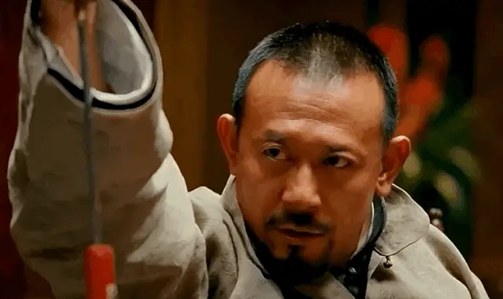
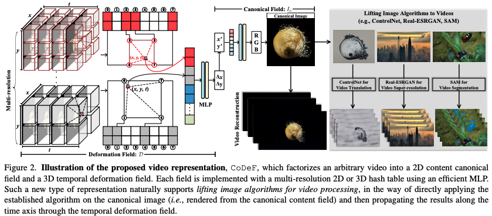
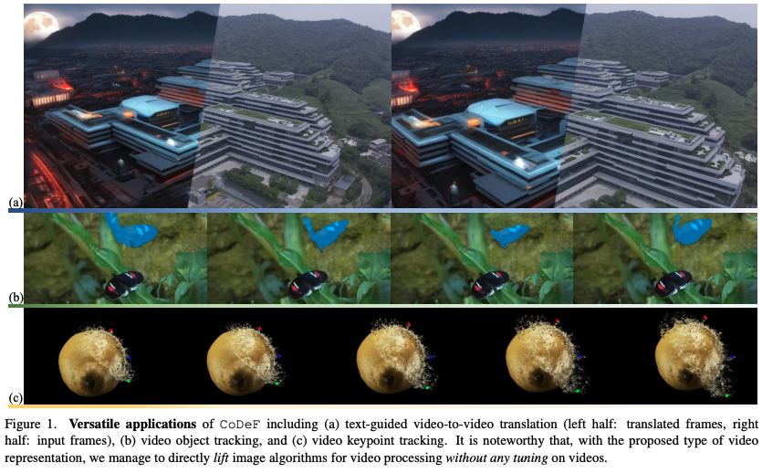

CoDeF能够对原视频做到精准控制，根据给到的提示词，它仅改变视频的画风，而且是针对完整视频。CoDeF是英文“the content deformation field”的缩写，即作者在此提出了一种叫做内容形变场的新方法，来用于视频风格迁移任务。   比起静态的图像风格迁移，这种任务的复杂点在于时间序列上的一致性和流畅度。比如处理水、烟雾这种元素，两帧画面之间的一致性非常重要。在此，作者“灵机一动”，提出用图片算法来直接解决视频任务：

他们只在一张图像上部署算法，再将图像-图像的转换，提升为视频-视频的转换，将关键点检测提升为关键点跟踪，而且不需要任何训练。

这样一来，相较于传统方法，能够实现更好的跨帧一致性，甚至跟踪非刚性物体。具体而言，CoDeF将输入视频分解为2D内容规范场（canonical content field）和3D时间形变场（temporal deformation field）：

- 2D内容规范场（canonical content field）：用于聚合整个视频中的静态内容
- 3D时间形变场（temporal deformation field）：负责记录图像沿时间轴的每个单独帧的转换过程

利用MLP（多层感知器），每个场都用多分辨率2D或3D哈希表来表示。  在此，作者特意引入了正则化，来保证内容规范场能够继承原视频中的语义信息（比如物体的形状）。如上图所示，这一系列设计使得CoDeF可以自动支持各种图像算法直接应用于视频处理，也就是只需利用相应算法提取出来一张规范图像，然后通过时间形变场沿着时间轴传播结果即可。比如，给CoDeF“套上”本用于图片处理的ControlNet，就可以完成视频风格的“翻译”（也就是我们开头和第一段看的那一堆效果） 

# Source
[GitHub - qiuyu96/CoDeF: Official PyTorch implementation of CoDeF: Content Deformation Fields for Temporally Consistent Video Processing](https://github.com/qiuyu96/CoDeF) [爆火「视频版ControlNet」开源了！靠提示词精准换画风，全华人团队出品](https://zhuanlan.zhihu.com/p/651150143) [https://arxiv.org/pdf/2308.07926.pdf](https://arxiv.org/pdf/2308.07926.pdf)
