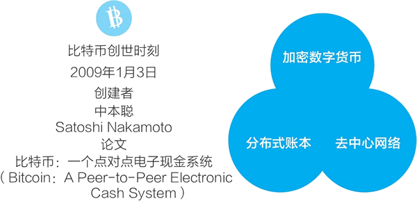
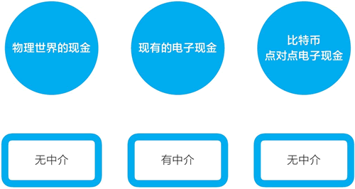
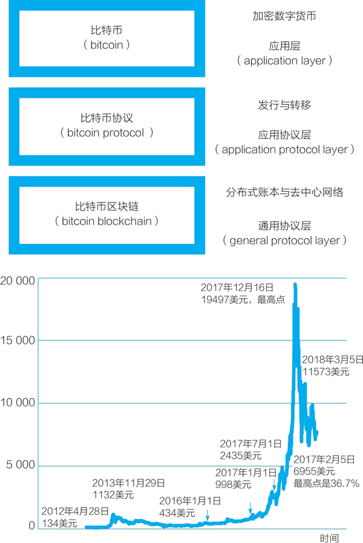
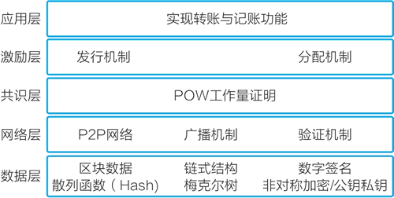
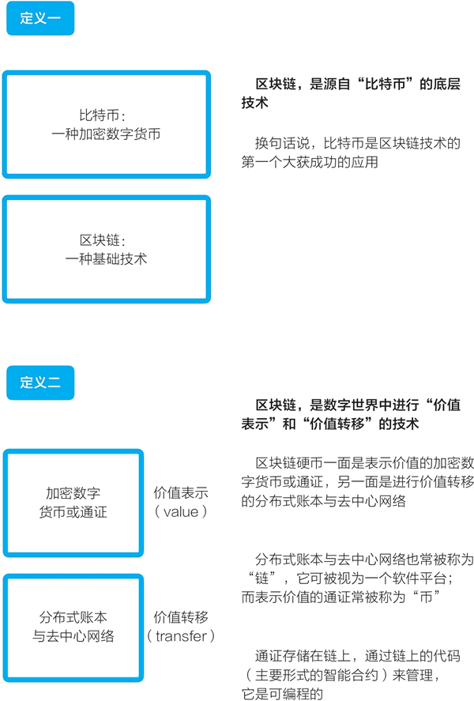
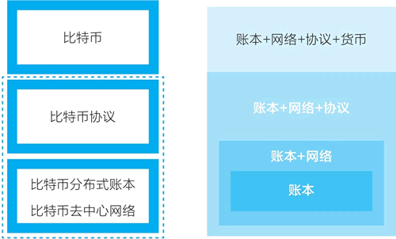
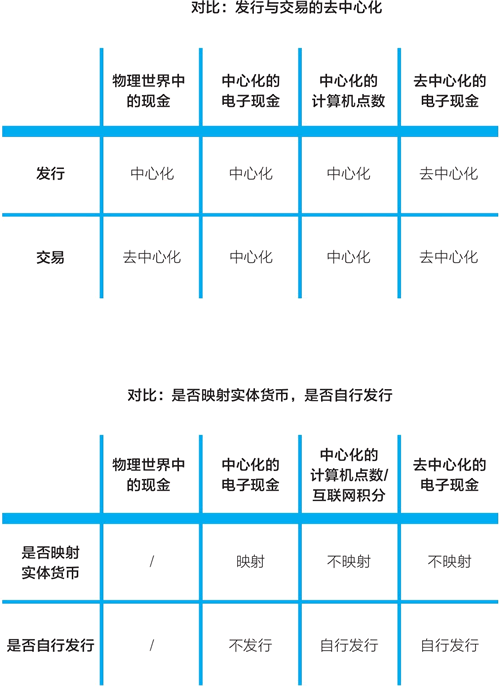
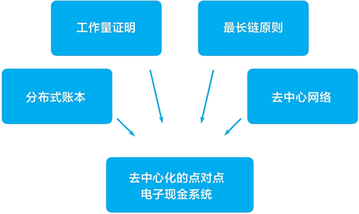

# [区块链是什么](http://c.biancheng.net/view/1884.html)
---
## 区块链是什么
### 区块链
区块链，可能是当下最有前景又充满分歧的技术与经济趋势。它给数字世界带来了“价值表示”和“价值转移”两项全新的基础功能。其潜力正在显现出来，但当下它又处于朦胧与野蛮生长的阶段。

对比互联网的发展史，现在的区块链可能相当于 1994 年的互联网，即互联网刚刚进入大众视野的时期，那也是第一波互联网革命萌芽的时期。谷歌、亚马逊、Facebook、腾讯、阿里巴巴、优步、滴滴，甚至现在市值超万亿的苹果都得益于那一时刻。

现在区块链技术可能带来互联网的二次革命，把互联网从“信息互联网”带向“价值互联网”。在区块链的对照之下，人们发现，最初被形象地称为“信息高速公路”的互联网处理的是“信息”，而区块链能处理的是“价值”。

变革即将发生，未来已来。我们又一次处于革命的起点——价值互联网的变革，而要理解价值互联网的未来，我们先要搞明白区块链技术是什么。

让我们回到10年前，从中本聪（Satoshi Nakamoto）发明比特币的那一刻说起。

---
###比特币的诞生
2009年1月3日，在位于芬兰赫尔辛基的服务器上，至今匿名的神秘技术极客中本聪生成了第一个比特币区块，即所谓的比特币创世区块（genesis block）。

在 创世区块的备注中，中本聪写入了当天英国《泰晤士报》的头版头条标题：
```
“The Times 03/Jan/2009 Chancellor on brink of second 
bailout for banks” 
“《泰晤士报》，2009年1月3日，财政大臣站在第二次救助银行的边缘”
```
这样做，他记录了比特币系统启动和创世区块生成的时刻，又借这句话表达了对当时全球金融体系的暗讽。2009 年年初，全球金融体系刚经历了 2008 年金融危机的冲击，看起来摇摇欲坠。

在生成创世区块时，按自己设定的规则，中本聪获得了 50 个比特币奖励，这是最早的 50 个比特币。从创始区块开始，在比特币的账本上每 10 分钟就有新的数据区块被增加上去，新的比特币被凭空发行出来。比特币的去中心网络开始运转，扩展到现在的由数万个节点组成的全球网络。

在比特币的创世时刻，它的三个组成部分都出现了，即加密数字货币（cryptocurrency）、分布式账本（distributed ledger）、去中心网络（decentralized network），如下图所示。  

    

2008 年 10 月 31 日，中本聪向一个密码学邮件列表的所有成员发送了一个电子邮件，标题为“比特币：点对点电子现金论文”。  
> [中本聪邮件](https://www.mail-archive.com/cryptography@metzdowd.com/msg09959.html)  
> [比特币白皮书](www.bitcoin.org/bitcoin.pdf)  

他写道：“我一直在研究一个新的电子现金系统，它完全是点对点的，无须任何的可信第三方。”比特币的起源应远早于这个日期，中本聪曾说，他从 2007 年 5 月就开始为比特币项目编程。2008 年 8 月，他注册了 bitcoin.org 域名，这是现在比特币项目的官方网址。

在邮件中，他附上了比特币白皮书的链接，论文题为“比特币：一个点对点电子现金系统”（Bitcoin:A Peer-to-Peer Electronic Cash System）。中本聪在2008年发表的这篇论文可能是互联网发展史上最重要的论文之一，其他重要论文有利克里德写的开启互联网前身阿帕网的“计算机作为一种通信设备”（1968年）、蒂姆·伯纳斯-李写的万维网协议（WWW）建议书“信息管理：一个建议”（1989年）、谷歌联合创始人谢尔盖·布林与拉里·佩奇写的搜索引擎论文（1998年）等。

可以合理地推测，中本聪不是一个学院派的研究型学者，他可能是一个做实际软件工程开发的工程师，因为他不只设计了比特币系统，还把它开发出来，让它在互联网上运行起来。他可能是先开发了软件，才写了上面提到的重量级论文，来解释自己的设计。

2008 年 11 月 16 日，中本聪公布了比特币系统的源代码。在发布白皮书、将软件代码开源后，在 2009 年 1 月 3 日这一区块链的创世时刻，最终他在互联网上上线了比特币网络。之后，中本聪和几个开发者在网上一起讨论想法，继续开发迭代。随着比特币网络的成熟，他的活动开始减少，比特币系统逐渐进入自治运转的状态。最终，在发明比特币系统 3 年后，自 2011 年 11 月后，中本聪永远不再出现。他成了一个永远匿名的传奇，没人知道他是谁，他只留下了自己的创造。

---
###中本聪为何创造比特币

在创造比特币的过程中，中本聪发明了区块链技术，区块链是源自比特币的底层技术。那么，他为什么要创造比特币？他想解决什么难题？

现在，比特币常被称为一种“加密数字货币”，人们常很关注其中的“货币”二字。其实，比特币并不具备现在各国法定货币的特征，它只是一种数字形式的特殊商品。比特币现在的市场价格和暴涨暴跌也影响着人们对它的看法，人们把它类比为黄金、郁金香等各种投资、投机标的。

但如果回到中本聪创造它的时刻，我们会看到，比特币的出现是源于技术极客想解决的一个技术难题：“在数字世界中，如何创造一种具有现金特性的事物？”“比特币：一个点对点电子现金系统”这个标题体现出了中本聪想解决的难题：他想创造在数字世界中可用的电子现金，它可以点对点也就是个人对个人交易，交易中不需要任何中介参与。

来对比看看。在物理世界中，一个人可以把现金纸币给另一个人，不需要经过诸如银行、支付机构、见证人等中介机构。

但由于数字文件是可复制的，复制出来的电子文件是一模一样的，因而在数字世界中，我们不能简单地用一个数字文件作为代表价值的事物。同时，我们在支付机构中有多少钱，并没有像一张张钞票一样的数字文件可以代表，钱仅是中心化数据库中的记录。

在数字世界中，当一个人要把现金转给另一个人时，必须要有中介机构的参与。比如，我们通过支付宝转账的过程是：支付宝在一个人的账户记录里减掉一定金额，在另一个人的账户记录中增加一定金额。

在数字世界中，如何创建一个无须中介或者说去中心化的数字现金，一直是一个难题。由于数字文件可以完美复制，如果没有一个中心化数据库做记录，那如何避免一个人把一笔钱花两次？

这就是所谓的双重支付或双花问题（double spending）。在比特币出现之前，我们熟悉的主要电子现金系统（如PayPal、支付宝等）都是依靠中心化数据库来避免双花问题，这些可信第三方中介不可或缺，见下图。



但在另一条道路即去中介或去中心化的电子现金这条路径上，有很多技术极客一直在做着各种尝试，只是一直未能获得最终的成功。

到了 2008 年，中本聪借鉴和综合前人的成果，特别是现在常被统称为密码朋克（cypherpunk）的群体的成果，改进之前各类中心化和去中心化的电子现金，加上自己的独特创新，创造了比特币这个点对点电子现金系统，在无须中介的情况下解决了双花问题。

特别地，比特币这个电子现金系统是同时去中介化和去中心化的：

> + 个人与个人之间的电子现金无须可信第三方中介的介入，这是去中介化。    
> + 这个电子现金的货币发行也不需要一个中心化机构，而是由代码与社区共识完成，这是去中心化。  

要注意的是，这个“电子现金”中的现金指的并非货币，它只是在解决难题的过程中被借用来在数字世界中代表价值的说法。这样说是为了便于理解，在现实中，最常见的代表价值的事物是现金。

最初，比特币这个用以表示价值的电子现金并没有价格。比特币系统只是在逻辑上可行的系统，是解决了一个难题的技术玩具。2010 年 5 月 22 日，在一个网络论坛上，有一个程序员用 1 万枚比特币换了两张棒约翰比萨的代金券，比特币第一次有了一个公允价格：1 万枚比特币价格为 25 美元。为了纪念这一天，每年的 5 月 22 日变成了区块链世界的一个节日——比特币比萨节。

此后，比特币虽然从来都不是货币，但逐渐地有了价值与价格。比特币的价格在自由市场交易中被确定，又持续、反复地大幅波动。但是，不管是从早期的 1132 美元跌掉一半，还是在 2017 年年底快速上涨到接近 2 万美元，又在几个月内跌到只有三分之一，比特币系统和它底层的区块链技术都保持稳定。

中本聪设计和编码实现的比特币电子现金系统至今已运转近十年。比特币系统已经从一个技术玩具变成一个运转得近乎完美的系统，并且看起来还将长期稳定地运转下去。

---
##从比特币系统中发现区块链

在物理世界中，现金是一张张纸币，但其背后有着一整套与货币相关的金融体系：中央银行、银行、印钞厂、信用卡组织，以及后来出现的第三方网络支付机构等。

在数字世界中，想要创造一种去中介化、去中心化的“电子现金”，同样要设计一套完整的系统。这一系统要能解决以下一系列问题：  

+ 这种“现金”如何公平、公正地发行出来，不被任何中心化的机构或个人控制？  
+ 如何实现像在物理世界中一样，一个人可以直接把现金递给另一个人，无须任何中介的协助？  
+ 这种电子现金如何“防伪”？在数字世界中，这个问题可转换为，一笔电子现金如何不被花费两次？  

中本聪设计和开发了比特币系统，完美地解决了这些问题。说起比特币，人们常指的是比特币这种做价值表示的电子现金。其实，作为电子现金的比特币只是比特币系统的表层，比特币系统包括三层，见下图：

+ 最上一层是比特币这种电子现金。这是整个系统的应用层。  
+ 中间一层的功能是发行比特币与处理用户间的比特币转移。这一层也叫比特币协议（bitcoin protocol），是整个系统的应用协议层。  
+ 最底层是比特币的分布式账本和去中心网络。这一层也被称为比特币区块链（bitcoin blockchain），是整个系统的通用协议层。  

比特币系统的三层命名（应用层、应用协议层、通用协议层）源自知名区块链研究者梅兰妮·斯万，她也提出了被广泛引述的一种阶段划分：区块链 1.0 是货币、区块链 2.0 是合约、区块链 3.0 是应用。

> 梅兰妮·斯万（Melanie Swan）著有《区块链：新经济蓝图及导读》（Blockchain:Blueprint for a new economy）。应用层、应用协议层、通用协议层的分类参见她的演讲。




比特币系统实现的去中心化的点对点电子现金，其发行与转账靠的是中间的比特币协议层。类比现实货币系统，这一层的角色相当于中央银行（发行货币）与银行（处理转账）等金融机构。

来深入看看名为“比特币协议”的这一层。比特币系统架构图又常被进一步细分为五层（见下图），它对应的是比特币协议和比特币区块链两个部分。在这个五层架构中，比特币协议层被细分为：应用层、激励层和共识层。



在设计比特币系统时，中本聪创造性地把计算机算力竞争和经济激励相结合，形成了工作量证明（proof-of-work，POW）共识机制，让挖矿计算机节点在计算竞争中完成了货币发行和记账功能，也完成了区块链账本和去中心网络的运维。这就形成了一个完整的循环：矿机挖矿（算力竞争），完成去中心化记账（运转系统），获得比特币形式的经济激励（经济奖励）。

比特币的工作量证明共识机制是承上启下的一层，连接了上层应用与下层技术：在其上的层次为电子现金的发行、转账、防伪；在其下的层次，去中心网络的节点达成一致，更新分布式账本。

之后在讨论区块链的现在与未来时，我们会不断地回到比特币系统的设计上来，它是一个简单又精妙的系统，融合技术和经济因素，是区块链所有创新的源头。

##区块链的定义
至此，相信读者已经大概能明白了区块链是什么了，最后，再让我们从不同的角度给区块链下一个定义吧。
###第一种区块链的定义（比较通俗）
比特币：一种加密数字货币；区块链：一种基础技术。

区块链是一种源自于“比特币”的底层技术。换句话说，比特币是区块链技术的第一个大获成功的应用。
###第二种区块链的定义
区块链是数字世界中进行“价值表示”和“价值转移”的技术。区块链硬币一面是表示价值的加密数字货币或通证，另一面是进行价值转移的分布式账本与去中心网络。

分布式账本与去中心网络也常被称为“链”，它可被视为一个软件平台；而表示价值的通证常被称为“币”。

通证存储在链上，通过链上的代码（主要形式的智能合约）来管理，它是可编程的。



##一般所谓的区块链是什么
比特币系统包括三层：比特币、比特币协议、比特币区块链，即比特币的分布式账本与去中心网络。那么，从比特币系统来对照看，说区块链时，我们说的可能是什么？



区块链这个说法包括四种可能性，所覆盖的范围逐步变大，见上图：  

+ 可能性之一，区块链指的是比特币的数据结构，即由数据块（block）连接形成的链（chain），这也被称为“分布式账本”。在比特币白皮书中，中本聪分别提及了区块和链，但后来它们才被组合成了区块链（blockchain）这个新词。
+ 可能性之二，区块链指的是比特币的分布式账本和去中心网络的组合。对应于比特币系统，它指的是整个第三层比特币区块链。
+ 可能性之三，区块链指的是比特币系统的第二层（比特币协议）和第三层（比特币区块链）的组合。它包括分布式账本、去中心网络和比特币协议。
+ 可能性之四，区块链指的是整个比特币系统，包括所有三层，既包括价值表示的比特币，也包括了背后支撑的整个系统。从这个范围看，是把区块链看成一个既包括技术部分，又包括经济部分的完整系统。

大众在提及区块链时，常指的是第四种最大的范围，即“账本+网络+协议+货币”。在产业中，人们在提到区块链时，通常指的是第三种范围，即“账本+网络+协议”。而很多软件开发者在说起区块链时通常指的是第二种范围“账本+网络”，即分布式账本加去中心网络。

现在，很多人的一种看法是，将基于区块链的价值表示物都称为通证，并把比特币等代币（coin）视为通证的一个特定种类。通常而言，提及加密数字货币、通证、代币时，我们指的都是基于区块链的、在数字世界中进行价值表示的事物。如果采用“通证”说法，区块链的最大范围包括的则是“账本+网络+协议+通证”。

---
#什么是去中心化?比特币是如何实现去中心化的?
中本聪解决了自己定义的难题“点对点的电子现金”，在这个过程中，他“发明”了区块链技术。比特币系统融合密码学、博弈论和软件工程等三个领域的技术与理论，区块链技术是已有技术巧妙地组合形成的创新。中本聪不是凭空解决“点对点电子现金”这个难题的，他沿着前人的足迹前进，只是他完成了最后一跃。

接下来，我们来具体地看中本聪是如何解决他定义的难题，创造一个在数字世界中做价值表示的事物的。在讨论中我们会特别关注，他是如何实现“去中心化”的？

##什么是去中心化？

在说"货币"时,我们讨论的是数字世界中的价值表示.在互联网上的数字世界中,人们曾设计出各种各样的电子现金或数字现金方案,在为《区块链:技术驱动金融》一书撰写前言时,杰里米·克拉克收集了约100种支付系统.他写道:"在通往比特币的道路上,布满了无数失败的尝试."在所列的各种系统中,他认为大众所知道的只有PayPal.当然,在移动支付超前发展的中国,我们都很熟悉支付宝与微信支付.

一直以来,数字世界中的"货币"有三种形式(见下图):
> + 中心化的在线支付；  
> + 中心化的计算机点数或互联网积分；
> + 去中心化的电子现金。


###第一种形式:中心化的在线支付

我们常用的PayPal、支付宝、微信支付都是中心化的在线支付,在这些支付系统中流转的是映射到数字世界的各国的法定货币(也称法币).

> 法币（fiat money）是“法定货币”或“法偿币”的简称，它依靠政府的法令成为合法流通的货币。法币是各国政府发行的纸币，发行者没有将货币兑现为实物（如黄金）的义务。

> 法定货币的价值来自拥有者相信货币将来能维持其购买力，本身并无内在价值。历史上，在政府强制规定纸钞为法定货币之前，大多数流通的货币具有一定的内在价值，例如金币、银两，它们又被称为商品货币(commodity money）。

> 在布雷顿森林体系中，35美元能兑换1盎司（1盎司＝28.35克）黄金，因而当时的美元不是法币。之后，当美元与黄金脱钩后，美元就变成了法币。

###第二种形式：中心化的计算机点数或互联网积分

中心化的互联网积分/计算机点数是指Q币、游戏币、航空里程等,它们还曾有一个更为大众所熟知的名字——虚拟货币.通常,它们不与物理世界的法币对应,而是由商业公司中心化发行,仅可以在一家公司的体系中使用.

###第三种形式：去中心化的电子现金

去中心化的电子现金已经被计算机密码学家探索了多年,沿着前人的探索路径,中本聪最终将这条路径变成了现实.中本聪设计和开发了比特币系统,并催生了众多加密数字货币和区块链技术项目.

三种形式与物理世界中的现金对比如下图:



###第一种形式：PayPal、支付宝、微信支付

现在，被互联网用户广泛使用的主流支付系统是 PayPal、支付宝，以及后来出现的移动支付 Square、微信支付等。这些第三方在线支付系统依赖于物理世界中的货币系统与金融体系，它们在数字世界中为用户提供支付、转账等服务。在使用它们时，我们所用的钱是物理世界中的法币，如美元、人民币、欧元、日元等，钱从银行账户中被映射到网络支付账户中。

过去，信用卡、储蓄卡等塑料卡片实现了纸币现金的数字化，把纸币现金变成了卡片账户中的数字现金。现在，在线支付系统将信用卡和储蓄卡的功能转移到互联网数字世界中来了。

在这些系统中流转的都是与法币一一对应的电子现金，变化的仅仅是“账户”，而非“货币”。这些系统所起的作用是，在账户和货币上连接物理世界与数字世界。

这些系统都是中心化的。它们背后所依赖的传统金融系统是中心化的，法币是由各国央行发行的。它们自身是完全中心化的，由单一机构运转网络支付系统。它们在交易中担任中心化的中介角色，进行账户的记账，是用户间数字现金流通的中心。当两个用户进行转账时，在线支付系统在中间担任可信第三方的中介角色。这就是为什么称之为“中心化的电子现金”。

###第二种形式：Q币、游戏币等互联网积分或计算机点数

在互联网上，除了在线支付系统之外，还有一种过去常被称为“虚拟货币”的货币现象。

比如，用户可以用人民币购买腾讯公司的Q币，腾讯自称它是“统计代码”。Q币可以在腾讯的产品如QQ即时通信工具、网络游戏、音乐文学等中使用，兑换各种在线服务。

> 关于“什么是Q币，它有什么用处”的问题，腾讯网站上的解释是，Q币是用于计算机用户使用腾讯网站的各种增值服务的种类、数量或时间等的一种统计代码，并非任何代币、票券，不能用于除腾讯网站增值服务以外的任何商品或服务。

又比如，在游戏中，用户可以付钱购买道具，也可以通过战斗赢取游戏币。这些道具和游戏币的形态与价值各不相同，在一个游戏中都很难确定价格、进行兑换，在多个游戏之间几乎不可互换。当然，游戏玩家还是可以找到办法进行交换，在一定条件下甚至还可以将它们变现换回法币，例如，曾流行的“游戏打金”就是指有些玩家专门在游戏中获得金币，然后卖出获得现金收入。

正如腾讯用“统计代码”的说法所表明的，Q币等是中心化机构（通常是一家公司）发行与管理的互联网积分或计算机点数。它们是中心化的，其发行和交易都是中心化的。

一般来说，在不需要用户付费购买时，它们常被称为“积分”，在需要用户付费购买时，它们常被称为“点数”。

但近年来出现了很有意思的混合产物。在打车软件中，用户可以存入现金，如存 100 元得 150 元；也可以介绍其他人成为打车软件的用户从而获得奖励，如介绍一个新用户双方各获得 50 元余额。在这种情况下，在打车软件钱包中的余额就变成了一定程度上的点数与积分的混合物。在打车软件钱包中的余额一般是不能提现的，也不能在用户之间直接转账，至多只能帮其他用户代付车费。

我们还可以进一步对比在线支付系统和计算机点数。

+ 一个视角是，它们是否映射物理世界中的货币。在线支付系统是映射物理世界中的货币的，电子现金价值就是货币的价值。而对于游戏迷来说，游戏币、游戏道具通常是不映射物理世界中的货币的。对游戏迷而言，游戏道具既有价值也有价格；对其他人而言，游戏道具可能毫无价值。在线支付系统与法币无缝连接，而这些互联网积分/计算机点数系统只与现实世界中的货币系统有很少的连接点，并且由于法律、商业等方面的原因，一般没有畅通的渠道将它们兑换回法币。

+ 另一个是视角是“电子现金”或“点数/积分”是如何发行的？与在线支付系统不同，点数/积分是由一家公司自行发行的，用户付费获得点数，可被认为是向这家公司购买一种数字商品，用户稍后可用这些点数兑换成该公司体系内的虚拟商品或服务。


直到最近，与现实世界相连的在线支付系统和不与现实世界相连的互联网积分/计算机点数都是互联网中的主流。变化始于比特币的出现。

###第三种形式：去中心化的电子现金

在这两个主流之外，一直还有着另外一种探索：能不能创造一种完全去中心化的点对点电子现金？其中最终极的设想是，在数字世界中，货币的发行和交易都不需要中心化机构介入，是由计算机自动执行的：在发行时，无须类似各国央行的中心化机构；两个人在相互转移电子现金时，也无须中心化机构的参与。

按前面的对比表格，这种理想化的去中心化的电子现金几乎在每个方面都试图进行突破：不映射线下的货币，而在数字世界中自行发行；发行去中心化，不需要一个类似中央银行的角色；像物理世界中的现金交易一样，交易无须中介介入。

这个问题很难，因为它的要求与数字世界中的技术基础设施的能力相悖。其中重要的一点是，在物理世界中，表示价值的现金纸币是不能复制的。但在数字世界中，数字化文档是可以复制的，每一个复制出来的文档都一模一样。因而过去在数字世界中，要用数字文件表示价值（比如表示一笔电子现金），我们需要一个中心化机构来确保数字文件是唯一的。假设这笔电子现金现在属于我，当我把它转给你时，我们需要一个中介来协助记录所有权的变更，我不能直接把数字文件复制给你。

计算机密码学家们探索的是，在无须中心化介入的情况下，如何通过密码学的方法，用可复制的数字文件来代表价值。

这是一个漫长的探索过程，其开端甚至比互联网商业化都还早，最早可追溯到 20 世纪 80 年代。总的来说，由于这种探索是基于加密技术的，因此各种去中心化数字现金也被称为加密数字货币（crypto-currency），其中 crypto 是密码学（cryptography）的词根。

最终在 2008 年，匿名的中本聪在密码朋克的邮件列表中发布了比特币的设计。他发明的比特币系统几乎集合了第三类探索的所有智慧结晶，他又加入了新的创新，最终在电子现金的发行和交易上都实现了去中心化。

正如我们所知，中本聪不只是设计和实现了这个最理想化的去中心化电子现金，他还“发明”了区块链技术。区块链的价值表示和价值转移功能让它可能成为新一代互联网的技术基础。

##比特币实现了极致的“去中心化”
对照前文图表，与现有中心化的电子现金系统（在线支付系统）相比，比特币是与之完全相反的：

+ 在线支付系统的货币发行是中心化的，比特币的发行是去中心化的；  
+ 在线支付系统的货币流动是中心化的，比特币的交易是去中心化的；   
+ 在线支付系统映射物理世界中的货币，比特币不映射任何现有的货币；  

在线支付系统自己不进行货币的发行，比特币是在数字世界中凭空发行出来的。

在去中心化的程度上，比特币系统达到了极致。去中心化的初级阶段是自动化（automatic），即根据人设定的规则自动运行，而去中心化的高级阶段是自治（autonomous），也就是完全自治、自发。而比特币系统作为一个电子现金系统，达到了极致的去中心化状态：

+ 作为一个货币应用，它不只交易是自治的，它的发行也是自治的。  
+ 作为一个计算机网络，它是完全去中心化的，而不仅仅是分布式网络。  
+ 作为一个组织，它是完全的社群自治，不需要有一个领导者居中协调。  

去中心化处于区块链的思维模式的最内核，而比特币实现了极致的去中心化。  


不过，之后在发展区块链技术和将之应用的过程中，我们又不得不从最极致的理想状态往实用方向调整，比如：

+ 现在多数区块链项目都是由基金会管理的。以太坊是由创始人维塔利克·布特林（人称“V神”）和以太坊基金会居中协调的，而不像比特币社区那样是完全自治的。  
+ 常在金融系统中使用的联盟链，以及部分节点数量不多的基础公链，如小蚁（NEO）、EOS，更应被视为分布式网络，没有实现完全的去中心网络。  
+ 通过以太坊发行基于 ERC20 标准的通证，通证的发行规则是由项目方确定的，在运行过程中会酌情更改规则。它们的发行不是自动的或自治的。  
+ 常被视为区块链 3.0 代表的 EOS 在智能合约部分引入了李嘉图合约和社区仲裁机制，也即交易部分不再是完全交给机器自动执行，在需要时人可以参与和干涉。  

我们反复讨论比特币系统的设计，是因为它早已经把最极致的情况展现在所有人面前。而在将区块链技术落地应用的过程中，从最极致的去中心化往实用主义方向调整并不是倒退，而是事物发展的必然过程。

##比特币是如何实现去中心化的？

那么，比特币系统具体是如何实现极致的去中心化的呢？

在比特币白皮书《比特币：一个点对点电子现金系统》中，中本聪详细地解释了他是如何设计这个系统的。在其中，他确立了此后所有区块链系统的主要设计原则。

+ 一个真正的点对点电子现金应该允许从发起方直接在线支付给对方，而不需要通过第三方的金融机构。
+ 现有的数字签名技术虽然提供了部分解决方案，但如果还需要经过一个可信的第三方机构来防止（电子现金的）“双重支付”，那就丧失了（电子现金带来的）主要好处。
+ 针对电子现金会出现的“双重支付”问题，我们用点对点的网络技术提供了一个解决方案。
+ 该网络给交易记录打上时间戳（timestamp），对交易记录进行哈希散列处理后，将之并入一个不断增长的链条中，这个链条由哈希散列过的工作量证明（hash-based proof-of-work）组成，如果不重做工作量证明，以此形成的记录无法被改变。
+ 最长的链条不仅仅是作为被观察到的事件序列的证明，并且证明它是由最大的CPU处理能力池产生的。只要掌控多数CPU处理能力的计算机节点不（与攻击者）联合起来攻击网络本身，它们将生成最长的链条，把攻击者甩在后面。
+ 这个网络本身仅需要最简单的结构。信息尽最大努力在全网广播即可。节点可以随时离开和重新加入网络，只需（在重新加入时）将最长的工作量证明链条作为在该节点离线期间发生的交易的证明即可。

威廉·穆贾雅在《商业区块链》一书中对比特币白皮书摘要进行了分析，他总结了四个要点：  

1. 点对点电子交易；
2. 不需要金融机构；
3. 加密证据而不是中心化的信用；
4. 信用存在于网络，而不是某个中心机构。

而从这个摘要中，我们提炼出了比特币系统设计的五个要点：比特币的区块链系统是由分布式账本（即狭义的区块链）和去中心网络（点对点网络）组成的，形成链条的方式是工作量证明共识机制。最长链是由网络中的算力共同决定的，因而它是可信的，节点离开和加入依据的是最长链是可信的这一原则。这些组合起来形成了比特币系统。



###1) 去中心化的点对点电子现金系统
比特币要做的是一个“点对点的电子现金系统”，发送方和接收方直接交易，它们之间不需要中介机构的介入。

要去掉可信第三方等中介机构，就需要解决“双花问题”。在摘要中，中本聪给出了点对点网络的解决方案，并介绍了这个方案的核心——区块链。他并没有提到区块链（blockchain）这个词，但在论文中分别提到了区块（block）和链（chain）这两个概念。

###2) 分布式账本
比特币的区块链是基于工作量证明形成的带时间戳、存储数据的数据块和由哈希指针连接成的链条。

这个链条或者说账本以分布式的方式存储在比特币网络的各个节点上，因而也被称为分布式账本。

### 3) 工作量证明
比特币网络中的节点按照规则进行加密哈希计算，以竞争获得生成新区块的权利。节点在竞争获胜后就获得记账权，它生成区块成为最新区块后，就获得与新区块对应的挖矿奖励。  

工作量证明也是区块链账本的安全机制。如果不重做“工作量证明”所需的大量计算则此链条不可修改，这一共识机制保证了区块链上的数据的可靠性。

### 4) 最长链原则
在任何时刻，最长的链条是所有人都接受的最终记录。

由于最长链是由网络中的主要算力完成的，因而只要它们不都与攻击者合作，那么它们生成的最长链就是可信的。这个原则被称为“最长链原则”。

###5) 去中心网络
比特币的去中心网络的架构非常简洁，本身需要的基础设施很少。它可以在互联网网络上运行。计算机节点可以随时离开或加入这个去中心网络，在加入时它们只需遵守最长链原则即可。

---
##比特币是如何转账的——比特币区块链的五个技术性细节

“互联网上的商务交易，几乎都需要借助金融机构作为可信赖的第三方来处理电子支付。”比特币白皮书的第一句话这样写道。中本聪是如何把可信第三方从比特币的交易中去掉的呢？    

通过两个人之间的转账交易，可看到比特币系统是如何实现交易的去中心化的？         

假设甲要把自己的钱包地址中的8个比特币转乙的钱包中,通过详细讨论转账交易过程,可看到比特币区块链工作的五个技术性细节(见下图)：  
      


###1、分布式账本和去中心网络

所有的区块链系统都包括“分布式账本和去中心网络”这一对必备要素。

比特币网络没有一个中心服务器，它是由众多全节点和轻节点组成的，这些节点形成一个去中心网络。其中：

+ 全节点包含所有比特币区块链的区块数据；
+ 轻节点仅包括与自己相关的数据。

比特币网络是完全开放的，任何服务器都可以接入、下载全部区块数据成为全节点。

所有用户持有的比特币信息都存放在一个<b>分布式账本</b>之中。这个账本是一个不断增长的由数据块组成的链条，这个数据块组成的链条是狭义的“区块链”。比特币账本可被认为同时存储在所有的全节点之中。

基于分布式账本与去中心网络，比特币系统实现了去中心化的价值表示和价值转移，它与中心化在线支付系统有很大的不同。用两个人之间的转账来对比看一下。

####中心化在线支付系统的交易流程

中心化在线支付系统的转账过程是：假设两人要通过支付宝进行转账,且他们都在支付宝开设有账户（account）,账户上有多少钱是支付宝账本上记录的数字。当甲转账 100 元给乙，支付宝在甲的账户记录上减掉 100 元，在乙的账户记录上增加 100 元，形成新的账本。到此，转账交易结束。   
如下图所示，中心化在线支付系统维护一个中心化的账本。用户在账本上开设账户，通过密码来与之交互。


####比特币系统的交易流程

对比而言，比特币系统使用的是一个分布式账本，用户在其中开设“账户”，严格地说是地址（address）。每个人都可以在比特币区块链上建立“账户”，获得一对公钥与私钥，地址是公钥的哈希值，我们通过私钥与地址进行交互。

我们每人有一个钱包，钱包中存储的是私钥。两个人在相互转账比特币时，可以通过各自的钱包软件直接进行。

在这里，比特币的去中心化体现在：不再有一个中心化机构来集中管理账本。账本存放在由众多节点组成的去中心网络中；不再有一个中心化机构来帮我们管理账户、处理交易，每个人管理自己的钱包，交易由分布式账本来记录。

有人会往下追问，我们地址中的比特币是记录在账本中的，看起来还是有一个“中心”存储我们的资产。其实，这个账本是分布式地存储在去中心网络中的，因而从这个层面看，它可以看成是去中心化的。

对比而言，对于中心化在线支付系统，它通常是由中心化的服务器来管理集中式账本。对于比特币系统，它背后的系统是一个去中心网络，网络节点共同维护一个分布式账本（见下图）。


###2、UTXO：未使用的交易输出，比特币核心概念之一

在比特币系统上其实并不存在“账户”，而只有“地址”。只要甲愿意，可在比特币区块链上开设无限多个钱包地址，甲拥有的比特币数量是甲所有钱包地址中比特币总和，比特币系统并不会把地址汇总形成账户。

从甲到乙的一笔比特币转账,是从甲的一个钱包地址转到乙的一个钱包地址上去.

接下来讨论比特币系统的一个关键技术性细节：UTXO(未使用的交易输出).通证经济专家孟岩曾撰写一篇文章，标题是"其实没有什么比特币，只有UTXO",这个标题指出对于计算机来说比特币其实就是区块链账本上的交易输出。

再来看下两个人进行转账交易的过程以深入理解UTXO：

假设甲有8个比特币,这意味着之前有一个交易把这些比特币转入甲的地址，这个交易的输出(即8个比特币)未被使用，甲拥有了这 8 个比特币。     
若现在甲要发起一个转账交易，这个交易中的输入是让甲拥有这些比特币的上一个交易。    
我要转账给你，我做的是，对让我拥有这些 8 个比特币的上一个交易进行签名，把这一新转账交易的输出地址设为你的钱包地址。    
这样甲发起了一个转账支付交易。等矿工将这一交易打包进新的区块，转账交易完成，这8个比特币就属于乙了。乙拥有的是甲乙这个交易的未使用的交易输出。     
对于一个交易签名所涉及的比特币的公钥和私钥的非对称加密机制，之后再讨论。为便于理解可类比看，钱包地址相当于房间号和锁，私钥则相当于钥匙，钥匙可以打开对应的锁。   

以上两个人的转账交易过程是：甲用私钥（从一个输出是甲的地址的交易中）取出比特币，并用私钥对从甲的地址转到乙的地址的新交易进行签名。一旦交易完成，这些比特币就转到乙的钱包地址中去。乙的钱包中新交易的未使用交易输出,只有乙的私钥才可以打开。

从以上讨论中可看到，确实不存在比特币，只有未使用的交易输出（UTXO）。每一笔比特币都源自上一个交易，可以一直向上追溯上去。而一直向上追溯，在每一笔比特币的源头，都有一种特殊的交易，即比特币矿工因挖矿获得奖励的创币交易，每一个比特币都是通过挖矿被创造出来的。假设甲作为比特币矿工挖矿成功赢得了25个比特币，那么这个特殊交易是，它的输入是 0，而输出是25个比特币进到矿工的钱包地址中。    

未使用的交易输出（UTXO）和平时熟悉的银行账户有着很大的不同。对比银行账户和比特币的 UTXO，我们可以看到 UTXO 的优点。

> 1 UTXO设计易于确认比特币的所有权

	如果采用传统的账户设计，当要转账8个比特币出去时，为了完全避免造假，就需要逐一向上追溯，确认之前的每一笔交易，从而证明我的确拥有8个比特币。  
	
	采用现在的UTXO设计，要确认我拥有8个比特币，只要确认上一个交易我的确获得了它们即可。通常只要上一个交易是真实的，我就的确拥有这些比特币。一般一个区块经过6次确认，其中的交易可被认为是真实无误的。

> 2 UTXO设计与区块链账本是完全融为一体的     

	区块链账本存储的是状态。以太坊是对比特币区块链的改进，在白皮书中，以太坊创始人维塔利克分析了比特币，他认为，“比特币账本可以被认为是一个状态转换系统（state transition system）”。以太坊也是采用这种状态转换系统的设计，但对之进行了改进。
	
	微观地看，每一个区块链中的交易都是一个状态转换函数，以太坊白皮书就用“以太坊状态转换函数”（Ethereum state transition function）来讨论在区块链上一个交易的进行过程。
	
	几乎所有的区块链都是采用这一设计，每一个新区块和它之前的所有区块一起形成了一个新的状态，如此重复、持续下去。在确认之后，之前的状态就不可篡改，即不可随意更改。UTXO（未使用的交易输出）是与这种状态的设计相对应的。

####加深对UTXO的理解
UTXO 是 unspent transaction outputs（未使用的交易输出）的缩写，每一个比特币其实都是 UTXO，它是比特币的最核心概念之一。    

> 参考资料：《区块链：技术驱动金融》中相应的讨论，及文章“比特币和以太坊的记账方式——UTXO 和账户余额”（黄世亮/文）。

#####比特币就是UTXO

比特币的挖矿节点获得新区块的挖矿奖励，比如12.5个比特币.这时钱包地址得到一个UTXO,即这个新区块的币基交易(也称创币交易)的输出。币基交易是一个特殊的交易，它没有输入，只有输出。

当甲要把一笔比特币转给乙，其过程是把甲的钱包地址中之前的一个UTXO用私钥进行签名然后发送到乙的地址。这个过程是一个新的交易，而乙得到的是一个新的UTXO。

这就是为什么有人说在这个世界上根本没有比特币只有UTXO的原因，钱包地址中的比特币是指没花掉的交易输出。

详看从甲转账给乙的过程

假设甲（Alice）向乙（Bob）转账，则转账过程可以分成三个阶段（见下图）：


1) 假设Alice之前通过挖矿获得了12.5个比特币，在其地址中这些比特币是某个币基交易的UTXO。   
2) Alice 发起一个交易，输入是自己的上一个交易，输出是Bob的地址，数量是12.5个比特币，Alice用自己的私钥对交易进行签名。   
   
> 这里简化了交易过程，只讨论了将上一个交易的输出全部转帐的情况。如果试图转出上一个交易的输出的一部分比特币，则要进行略复杂的处理。     
> 按照比特币系统的设计，比特币交易还要遵循一个原则：每一次交易的输入值都必须全部花掉，不能只花掉部分。比如，我的钱包地址中有8个比特币，要全部转给你；则很简单，我发起一个交易把这 8 个比特币转到你的钱包地址中，我签名确认这个交易。但假如我的钱包地址中有25个比特币，那我发起的交易就不是转给你8个比特币，然后自己的钱包地址中还剩下17个比特币。这时，我发起的交易是：从我的钱包地址中转8个比特币给你，同时转17个比特币给我的同一地址。

3) 当交易被区块链确认后，Alice的UTXO就变成了0。而在Bob的地址中就多了一个UTXO，数量是 12.5。存在Bob的钱包地址中的这些比特币只有用 Bob 的私钥才可以签名转账给其他人。

如果Bob要将这些比特币转账给其他人，则重复上述过程。

简单地说，从一个地址向另一个地址转账比特币的过程，是用这个地址对应的私钥打开，再加密到另一个地址的过程。这个私钥的打开和加密就是签名的过程。在这个过程中，接收比特币的一方并不需要动用自己的私钥。

#####我的比特币是什么样的？它们存在哪儿

初次接触比特币的人会问：我的比特币是什么样的？它们存在哪儿？   

如果你头脑中参照的是在物理世界中购买金币，那么这里很不一样，你的比特币并不是存在家中或金库中，并不存在一个数字文件表示“你的比特币”。     

如果你头脑中参照的是银行的存款，那么可以假设比特币就“存在”于一个账本上，而在数字世界中，价值是账本中的“记录”。       

不同的是，对比特币来说，这个账本不是一家银行的中心化数据库，比特币的账本是一个分布式账本，存在于一个去中心化的网络上。任何人都可以接入这个网络，把这个账本下载下来。但是，只有用你的私钥才能动用你的地址中的比特币。

我们还可以再换一个角度看，你的比特币在哪儿？按前面说的，比特币就是 UTXO，则比特币可以被看成是上面的物理世界金币和银行存款两种概念的混合：

> 一方面，比特币是有一个“物理存在”的,其对应着一个数据文件。比特币以一个交易的UTXO的形式存在着，每个交易都可被看成是一个数据文件。           
> 另一方面，所有这些交易被打包进区块链的区块中，后一个区块连着前一个区块，形成一条链，也就是独特的账本。这么看，你的比特币是这个账本上的记录。         

#####为什么采用UTXO的形式

UTXO与我们熟悉的账户概念的差别很大。我们日常接触最多的是账户，比如，我在银行开设一个账户，账户里的余额就是我的钱。   

但在比特币网络中没有账户的概念，你可以有多个钱包地址，每个钱包地址中都有着多个UTXO，你的钱是所有这些地址中的UTXO加起来的总和。     

中本聪发明比特币的目标是创建一个点对点的电子现金，UTXO的设计正可以看成是借鉴了现金的思路：我们可能在这个口袋里装点现金，在那个柜子角落里放点现金，在这种情况下不存在一个账户，你放在各处的现金加起来就是你所有的钱。

采用 UTXO 设计还有一个技术上的理由，这种特别的数据结构可以让双重花费更容易验证。对比一下：

> 如果采用账户和账户余额设计，Alice 要转账给 Bob，为了确保 Alice 的确有钱，我们需要核查她之前所有的交易。随着时间的推移，比特币的交易越来越多，这个验证的难度会持续上升。     

> 采用 UTXO 设计，我们只要沿着每个交易的输入逐级向上核查，直到查到这笔比特币的创币交易即可。随着时间的推移，这个核查也会变难，但变难的速度要远低于采用账户和账户余额设计。

这种设计使得比特币系统作为一种电子现金系统有着非常大的可扩展性。当然，我们很快会看到，通常被认为是区块链 2.0 的以太坊没有继续采用 UTXO 设计，而是考虑到其他因素，采用了账户余额的设计，其代价正是中本聪可能已经考虑到的复杂性。

###3、比特币区块链的数据结构

我们回到两个人转账交易的过程中，去理解比特币区块链的数据结构。

我发起一笔交易，即我向整个区块链网络广播，我和你两个人想进行这笔交易：我向你的地址中转入一笔比特币，无须你的许可。

但只有当这笔交易被打包进最新的比特币区块中时，这笔交易才真正完成。通常来说，当在一笔交易所在的区块之后又增加5个区块，即包括它自己在内一共经过6次确认时，这笔交易可认为被完全确认。按比特币每个区块的确认时间10分钟估算，即一笔交易最终确认要经过约1小时。

这里包括了两步：一是交易被打包进候选区块，每个节点可以按规则生成不同的候选区块；二是节点挖矿成功，候选区块被成功地加到区块链的尾部，成为最新的正式区块。

那么，把一笔交易打包进区块是什么意思呢？这涉及区块链最基础的数据结构，这也是它不可篡改的基础。

以下讨论可能略显枯燥，但却是认识比特币与区块链的最基础的知识，我尽量以通俗的语言来解释。

区块链之所以被称为blockchain，是因为它的数据块以链状的形式存储着。从第一个区块即所谓的创世区块开始，新增的区块不断地被连到上一个区块的后面，形成一条链条。

每个区块由两个部分组成——区块头部和区块数据。其中，区块头部中有一个哈希指针指向上一个区块，这个哈希指针包含前一个数据块的哈希值。哈希值可以被看成是数据块的指纹，即在后一个区块的头部中均存储有上一个区块数据的指纹。如果上一个区块中的数据被篡改了，那么数据和指纹就对不上号，篡改行为就被发现了。要改变一个区块中的数据，对其后的每个区块都必须相应地进行修改。

> 比特币区块链设计有一种机制让这种修改难以发生，我们稍后在谈到“工作量证明”和“比特币挖矿”时再详细讨论。

一个区块中的数据是被打包进这个区块的一系列交易。这些交易按照既定的规则被打包形成特定的二叉树数据结构——梅克尔树（Merkle trees）。按目前的比特币区块的大小，一个区块中能容纳的交易数量在 2000 个左右，比如在第 526957 个区块中容纳了 1804 个交易。
> 可通过如下网站查看比特币区块链的数据信息：[https://blockchain.info/](https://blockchain.info/)。

比特币区块链的数据结构中包括两种哈希指针，它们均是不可篡改特性的数据结构基础。一个是形成“区块+链”（block+chain）的链状数据结构，另一个是哈希指针形成的梅克尔树（见下图）。链状数据结构使得对某一区块内的数据的修改很容易被发现；梅克尔树的结构起类似作用，使得对其中的任何交易数据的修改很容易被发现。


###4、工作量证明共识机制

比特币的去中心网络采用的是工作量证明共识机制。

去中心网络之所以需要共识机制，是因为这是一个非基于信任（non-trust-based）的网络，任何人无须许可都可以接入这个网络。并且，这些节点分散在网络条件差异非常大的全球互联网之中。在完全无中心的情况下，这些节点要同步一致，共识机制即为这些节点达成一致的机制。

关于分布式网络的共识机制，有著名的“Fisher-Lynch-Paterson 不可能结果”，即在一定条件下达成共识是不可能的。而比特币的工作量证明共识机制在实践中被验证是有效的。这是因为它采用了一个实用主义的解决方案。

比特币的工作量证明的关键特点是，它巧妙地融合技术和经济因素，不只是纯粹通过技术本身来达到这一点，而是纳入了与自身作为一个数字现金系统相关的挖矿奖励。按《比特币：技术驱动金融》一书的分析，比特币的共识机制有两个与过去不同的特点，我们略做引申讨论。

####一、它引入了奖励机制
在这样一个加密数字货币应用中引入了经济激励，维护网络的节点就可以得到有价值的比特币作为奖励。

为什么比特币网络中的节点们愿意打包交易、维护账本？它们并非出于“善意”，而是因为，它们能因这些挖矿行为获得比特币形式的经济激励。这是一个自行发行的电子现金系统的独特优势，如果所开发的是其他没有自行发行代币的 IT 系统，我们就无法设计矿工挖矿奖励这样的经济激励机制。

激励挖矿节点参与挖矿的，除了与新区块相关的奖励之外，挖矿节点还可以得到区块中包含的所有交易付出的交易费。但到目前为止这个数值还较小，大概为新区块奖励的 1%。

####二、它包含了随机性的概念

比特币系统形成的共识不是完全可靠的，但是在等待了 6 个区块约 1 个小时之后，出问题的概率呈指数级下降。在 6 个区块之后，一个交易发生双花情况的概率可被认为是零。从纯理论上看，完美的共识不可能达成，但从实用的角度看，这个共识是可信的。

###5、比特币挖矿机制

挖矿节点计算机在挖矿时要做两个任务：
> + 第一个任务是把比特币网络中未确认的交易按梅克尔树组装成候选区块，未被纳入的交易则往下顺延。在创建候选区块时，除了普通的交易之外，矿工在其中增加一个特殊的交易：币基交易（coinbase transaction）。如果挖矿成功，则币基交易会凭空转出新区块的奖励比特币到矿工的钱包地址中，从而发行这些比特币出来。这个特殊交易也被叫作“创币交易”，新的比特币是在这一交易中被创造出来的。

> + 第二个任务是真正的挖矿，即进行加密哈希计算，解决一个计算难题，进行算力竞争。在众多争夺记账权的节点中，谁最先完成这个计算，它打包的区块就被加到了区块链的最后，成为最新的区块。率先完成计算的矿工会赢得新区块的挖矿奖励。最初，成功挖出一个区块，矿工可以获得 50 个比特币的奖励，按规则，这个挖矿奖励每四年减半一次，分别为 25 个、12.5 个，以此类推。

我们再讨论两个问题，以深入了解比特币的工作量证明共识机制与它的挖矿机制。

####第一，先向内看，比特币矿工挖矿是在做什么？

在候选区块的头部有一个 32 位的随机数区域，矿工需要反复调整随机数并计算，目标是让整个区块的哈希值小于一个“目标值”。如果试过所有的 32 位随机数可能性后，计算仍未能成功，那么就要改变币基（coinbase）的一个随机数，接着进行反复计算。

这个计算是加密哈希计算（对比特币来说是 SHA-256），除了反复计算别无他法。这个计算量非常大，比如在 2015 年年底，在大约 2 的 68 次方个随机数中，只有一个可以成功，这个数字比全球总人口的平方还要大。

有意思的是，这种挖矿计算是非对称的，你挖矿需要经过 2 的 68 次方个哈希计算，而我要验证你的确找到有效的随机数，只需要一次就可以。

第一个完成这个计算难题的节点所打包的区块就成为有效区块，它向全网广播告知自己已经完成，由其他节点确认后（即有别的挖矿节点在这个区块的基础上进行下一个区块的挖矿，生成新的区块）。在等待 6 个区块后，该挖矿节点就可以获得这次比特币奖励。

比特币的去中心网络能够长期运行下来，现在有 1 万多个全节点，正是因为有这样的挖矿奖励机制。出于对自己的利益考虑的矿工运维着这个不属于任何人、完全去中心化的网络。

####第二，再向外看，比特币的挖矿机制在加入挖矿的计算机的算力不断增加的情况下，这个挖矿机制是如何保持稳定的？

比特币挖矿的芯片已经经过几轮演变，其计算能力越来越强：从 CPU 演变到 GPU（显卡），再到现场可编程门阵列（FPGA），再到现在的专用集成电路技术（ASIC），即只能进行比特币挖矿所需的哈希计算的专用芯片中。并且随着矿机的升级迭代和数量增多，接入比特币区块链网络、参与挖矿竞争的计算算力越来越大。    

相应地，比特币系统有这样一个对应的机制设计：随着算力的增长，调整目标值的难度使得挖出一个区块的时间始终是 10 分钟左右。    

这形成了一种动态的平衡，维持区块链网络经济激励的有效与稳定。这个决定难度的公式非常简单明了，每挖出 2016 个区块，也就是经过约两个星期，挖矿难度会进行一次调整，该公式是：

	下一个难度 = 上一个难度 × 2016 × 10分钟 / 产生2016个区块所需的时间


如果算力突然大幅度上升，产生上一组 2016 个区块所需的时间变短，那么难度就会上升。在某些特殊情况下，如果产生上一组 2016 个区块所需的时间变长，那么难度也会下降，但这样的情况并不多见。

因此，比特币矿工节点的挖矿是它在运行分布式账本与去中心网络。同样重要的是，它也是比特币的发行机制和整个社区的激励机制。

比特币的挖矿是比特币的唯一发行机制，从中本聪挖出第一个区块获得 50 枚比特币开始，比特币这个加密数字货币就以这样的去中心化方式不断地发行了出来。

比特币区块链网络是由众多节点组成的去中心网络，而这些计算机节点加入这个网络，维护分布式账本，是因为中本聪在设计系统时巧妙地加入了经济激励：众多比特币矿工（即挖矿节点）在竞争获得记账的权利，矿工每增加一个新的区块能获得对应的记账奖励。

比特币的经济系统是以“竞争-记账-奖励”循环为核心的（见下图），其中“竞争”非常重要，即挖矿节点进行的算力竞争。在比特币系统这样一个去中心网络中，节点参与是出于获得经济奖励的自利动机，而记账权利和对应的奖励需要通过竞争来获得。   

> 在区块链的相关探讨中，有把“挖矿”一词的含义扩大的倾向，在这里我们认为，只有生成区块的计算行为，即运维分布式账本与去中心网络的行为，才是真正意义上的挖矿。简单地说，只有生产区块，才是挖矿。即便放宽要求，不再强求只有计算机节点生产区块才是挖矿，我们也仍想强调，竞争获得对应的权利和奖励，仍是必须的。没有竞争的奖励，是很难真实有效的。


通过讨论比特币区块链的五个技术性细节，我们再一次看到，比特币系统在发行和交易层面都实现了完全的去中心化：

+ 一个交易的确认，被写入分布式账本记录下来，是由去中心网络中互不信任的节点为了自己的利益相互以算力进行竞争而确认的。
+ 在竞争挖矿的过程中，比特币的发行是“凭空发行货币”，它的货币发行也是靠这个去中心网络的算力竞争来完成的，是去中心化的。

比特币作为区块链 1.0 的典型，完成了价值表示和价值转移的概念验证（见下图）。比特币区块链是非常精妙的设计，它无须任何人的居中协调与领导就能持续发展。比特币可能是迄今为止最成功的加密数字货币，比特币区块链在加密数字货币的应用上堪称完美。比特币区块链即“区块链1.0”是专为去中心化的电子现金设计的，而要在各个领域中广泛应用，我们需要有更通用、性能更好的区块链系统。


在沿着比特币系统所开创的路线开发各类基础公链时，开发者们从各个角度调整与改进以上五个技术性细节，形成新的区块链系统。在比特币系统之后出现了常被认为是“区块链 2.0”代表的以太坊。现在更多项目在竞争成为“区块链 3.0”，这些将在后面讨论.

---
##区块链的应用有什么？区块链将带来什么变革?

“区块链，是互联网的二次革命。”  
“区块链，是互联网2.0。”  
“区块链，让我们从信息互联网跨越到价值互联网。”   
这是从互联网发展的视角出发，对区块链有什么意义做出的一些回答。   
谈起区块链的前景，人们会列举它能改变金融、能源、零售、文化、社交、游戏、物联网等，但我觉得，以上回答更为有力。

从 1994 年互联网开始商业化，经过近 25 年的发展，互联网已经彻底改变了我们周围的一切——经济、产业、生活。互联网从 1995 年左右的“信息高速公路”的说法，变成了无处不在的力量。现在，如果区块链是互联网 2.0，互联网曾经带来的改变以区块链的方式再来一次，随着区块链技术的进步和相关基础设施的完善，各种意想不到的应用会涌现出来。   

###信息传递 VS 价值转移
之前，互联网处理的是“信息”；现在，互联网可以处理“价值”。从 2008 年到 2018 年，酝酿了近十年的区块链技术弥补了互联网与数字世界中一直缺失的另一半。区块链提供了在数字世界中处理价值所需的两个基础功能：价值表示与价值转移，让互联网跃迁到价值互联网.  


1990 年，万维网协议发明者蒂姆·伯纳斯-李写道：“一旦我们通过万维网连接信息，我们就可以通过它来发现事实、创立想法、买卖物品，以及创建新的关系，而这一切都是通过在过往时代不可想象的速度和规模来实现的。”到现在，互联网上的各种应用和服务，包括门户、视频、社交、即时通信、电商、打车、B2B、网络支付等，都是基于信息传递的基础设施、沿着他的设想逐步发展起来的。

在区块链出现之后，对照之下我们发现，信息传递的一个关键特征让互联网很强大，但有一个我们之前并未曾特别关注的限制：信息传递的方式是复制。这一特征让我们在数字空间中进行价值转移时，必须依赖可信第三方的协助。那些可信第三方，即各种各样的中心化机构，比如亚马逊、淘宝、支付宝、优步、滴滴、爱彼迎、微信支付，一直以来像本来就应该有一样，存在于互联网产业之中。

不管是网络零售、生活服务交易，还是企业互联网，每个从事交易的互联网项目都需要价值转移的功能，而这些平台在交易中担任信用中介的角色。特别地，在互联网上进行金钱的转移时，我们需要信用中介来居中协调，为了进行在线支付，互联网上已经产生了专门的信用中介，如 PayPal、支付宝、微信支付等。

直到 2008 年，当中本聪在比特币系统中开发出区块链这个底层技术，当他尝试创造新的技术来去掉这些信用中介，让网络本身来扮演信用中介的角色时，我们开始发现，现在互联网中的各种信用中介并非必须存在。

经过十年的发展，比特币系统展示了，在数字世界中价值表示可以去中心化，价值转移同样可以去中心化。

现在，我们仍需要各种“信用中介”，因为到现在为止互联网数字世界中的所有基础设施都是为了信息传递而建的。

未来，我们不再需要这些“信用中介”。基于区块链技术，我们可能建立一个通过网络本身进行价值表示、价值转移的全新交易基础设施。

如果价值表示和价值转移可去中心化，直接通过网络本身来进行，那么我们就将从“信息互联网”跨越到“价值互联网”。

要理解价值互联网，我们可以从对比信息传递方式和价值转移方式的差异开始。

###详解价值转移的方式：记录

信息和价值是完全不同的事物，信息传递和价值转移的方式完全不同。接下来，我们分别对比几组线下物理世界和线上数字世界的案例。

####报纸 VS 纸币

在线下物理世界中，信息的典型代表是报纸，而价值的典型代表是纸币。每一张报纸都是一样的，报纸编辑完成后，印刷机复制它，然后它被送到我们的手中。

对比而言，虽然纸币也是由印刷机印制的，每一张 100 美元纸币代表的价值是相等的，但每一张纸币都是不一样的，每一张都有唯一的序列号。

信息是可复制的，我可以复印一份报纸给你。价值不可以复制，我必须把100美元现金真的给你，而不能复印了给你。

到了互联网上，数字化的信息可以完美复制，这加快了信息的流动。而和价值有关的事物在互联网中没有发生同样倍数的变化。


####纸币的电子化：信用卡与在线支付

接着讨论现金交易。在商店中购物，我们付纸币现金，看起来在我们和商店收银员之间并没有任何中介。当然在这背后，这些现金会变成商店在银行账户上记录的数字，在现金交易完成之后有一个庞大的金融体系在运转。

当信用卡开始普及，现金开始被电子化的塑料卡片取代时，我们在刷卡支付时，一个第三方中介就出现在我们和收银员之间，它可能是维萨、万事达、银联等。这些信用中介做的事是：当我付钱时，从我的银行账户中减去我付的钱，在商店的银行账户中加上这笔钱。

在互联网出现之后，当我们在线上或线下使用支付宝、微信支付等第三方在线支付时，它们扮演着与维萨、万事达等信用卡组织类似的角色。

信用卡组织和在线支付系统做的事都是进行可信的记录，即在账本上进行记录，确认金钱的转移。

####价值转移依靠记录：房产与汽车的案例
在物理世界中，涉及除纸币现金之外的其他价值转移时，在多数情况下，我们转移价值的方式也是记录，而记录通常需要一个可信的第三方。

以房产的转移为例。我们把一个房产转让给别人，对方付了钱，我们怎么把房产这个价值转移给他？

他仅仅搬进这个房子住，并不能表示他已经拥有了这个房子的所有权。在古代，房屋买卖双方签订地契，在中文中，“契”字的含义是刻画记载，地契成为所有权的记录。

到了现代社会，我们的做法是，到不动产登记中心进行登记，在政府部门管理的账本记录（不动产登记簿）上更改房屋所有权的归属，对方拿到有着他的名字的房产本——“不动产权证书”。房产这个价值的所有权转移依靠的是“记录”。

对比古代和现代的做法，我们可以看到，过去的地契是去中心化的，而现代的房产登记是中心化的。

类似地，我们要把一辆汽车这样的动产转让给他人，现代社会的做法也是要去交通管理部门进行记录的变更，并获得新的车辆证照，如车辆行驶证。

> 在多数现代国家中，房产与汽车这两种资产都是由国家的相关部门来进行统一登记的。我们会发现，这里有两种记录：一是中心化数据库中的记录，对中国的房产来说，这个记录存在于国土资源部门集中管理的账本——“不动产登记簿”；二是产权人拿到的附属证明，即俗称的房产证——“不动产权证书”。如果房产证与集中账本中的信息不一致，或者车辆行驶证的信息与交管局数据库中的信息不一致，那么通常的做法是以集中账本中的记录为准。

###数字世界中的价值表示与价值转移

信息传递的主要方式是复制(见下图)。在互联网中不管是最基础的TCP/IP 协议，还是 WWW（万维网）协议，都是专为信息传递设计的。并且，数字化的信息复制可以复制出一模一样的副本，复制效率更高，互联网给信息传递带来了巨变。


价值转移的主要方式是记录。从物理世界到数字世界，价值转移的方式都是记录。但是，用数据文件进行价值表示会遇到很多困难，可完美复制的数据文件和需要唯一性的价值表示形成冲突。如果表示价值的数据文件可以完美复制，那么我就可能把它支付给你，再复制一份支付给另一个人，造成双花问题。在数字世界中进行价值转移时，为了防止双花问题，我们要依赖可信第三方作为中介，由它作为交易中心进行记录。

这事实上成为互联网往下一步发展的隐形障碍。

在互联网上，与信息相关的产品高速发展、成本快速降低。但是，由于需要可信第三方进行协调，与价值转移有关的事依然处在成本高、效率低的状态。互联网上的价值转移仍局限在少数的价值类别上，比如在线支付系统处理的现金、在线证券交易、之前讨论的Q币与游戏币等互联网积分。

中本聪设计的比特币系统，给数字世界中的价值表示和价值转移这两个关于价值的关键问题都提供了解决方案。中本聪的解决方案去掉了处在中间的可信第三方，实现了完全的去中心化，让网络自身就可以表示价值，通过网络自身来转移价值和进行记录。

在互联网上，互惠经济是一种常被讨论的现象，比如开发者参与开源软件的开发，人们共同编撰百科全书，知识爱好者在社区问答社区中分享知识。过去很多人认为，这是缘于这些互联网用户有着无私和互惠的精神，这的确是这些社区得以发展的重要原因。但或许也可以说，过去人们为社区贡献了力量，而不给予相应的代表价值的事物，这可能是因为，在数字世界中一直没有方便的方法进行“价值表示”，更没有方便的办法进行“价值转移”。现在，在有了区块链和它底层的区块链技术以后，我们就有了相应的技术手段。

到现在来看，对数字世界的价值表示和价值转移，比特币系统都进行了完美的概念验证，并经受住了时间的考验。比特币系统是一个试验性的系统，是极客们为了解决技术难题而开发的“技术玩具”。但从 2009 年年初开始运转起，不管比特币所表示的价值折算成法币是价值很小的 1 美元，还是高达接近 2 万美元，这一系统都运转正常。通过这一系统，我们可以在数字世界中进行价值转移，无须任何信用中介介入，比特币系统无须中介的点对点价值转移交易，被证明是有效的。

当然，比特币系统和源自它的区块链技术目前才跨过概念验证阶段，要作为投入工程应用的系统，满足亿万用户的使用，仍存在较大的性能问题。但不管怎样，区块链可能成为互联网数字世界中“价值表示”和“价值转移”的基础性协议（见图4）。有了比特币系统这个样板和区块链技术，互联网和数字世界中关于价值的一切都开始发生变化。       


###价值表示功能：分布式账本改变了互联网上的价值表示方式

当从比特币系统中发现区块链技术时，人们首先看到的是，它是一个“分布式账本”，并将之称为分布式账本技术（distributed ledger technology，DLT）。分布式账本的核心功能是做价值的表示，比如一个人持有的比特币是分布式账本中的记录。这些被表示出来的价值，又是在交易中体现出来的，因而我们仍可从价值转移来讨论价值表示。

数据文件是可完美复制的，在数字世界里，要转移价值就需要有一个信用中介居中协调，它们的功能是做价值所有权的记录，它们也维护着一个集中的账本用以记录。在过去的数十年内，转移金钱的信用中介（如在线支付系统）越来越易用，支付宝、微信支付在线上、线下都带来了很大的便利，它们也越来越智能，比如能更好地识别欺诈。但是，它们的组成结构未曾发生根本性的变化，见下图)：

+ 信用中介处在交易双方之间，协助完成价值转移。
+ 它们通常提供一个供用户使用的应用界面。
+ 它们维护着一个集中的账本。
+ 金钱是集中账本中的记录。


比特币系统彻底地改变了这个组成结构。通过各自掌握的比特币钱包软件，我们可以在个人与个人之间进行比特币转账。在进行比特币转账时，不再有一个信用中介帮我们保存和维护一个集中的账本并处理所有权的记录。区块链的账本以分布式的方式存在于互联网上，由去中心网络中的节点共同维护。

市面上存在多种比特币钱包，只要我们掌握自己的私钥，任何比特币钱包软件都是一样的。我们的比特币被存储与记录在分布式账本中，即有人简单说的在链上。

这里还想澄清一个常见的误解。在讨论区块链的分布式账本时，常有人说每个人保存自己的账本.

那么，我们是保存自己的账本吗？通过这个形象的图示我们可以看到，“每个人保存自己的账本”这个说法既对又不对。说它对是因为，每个人的确可以把比特币的账本都下载下来；说它不对是因为，逻辑上我们接入了一个由包括众多节点的去中心网络维护的分布式账本，比特币账本的运转逻辑并不是每个人都保存自己的账本，然后在需要的时候拿出账本来对账，而是我们共享一个云端账本。

特别地，比特币钱包中并不保存“账本”。账本是由比特币网络中的全节点维护的，而钱包软件是所谓的轻量节点或轻客户端，也叫简单付款验证客户端（simple payment verification，SPV），里面只保存了向你的地址付款的交易与区块头部。

更进一步追问，在区块链上，我们的数字资产存放在哪里？我们还是对照现实中资产的存储方式来理解区块链的资产存储。

比特币系统的设计在一定程度上是模拟黄金的设计。要特别说明，这里讨论的并非比特币本身有黄金一样的财富价值。对比黄金和比特币我们可以看到，比特币系统模拟的并不是实体黄金。如果我们拥有实体黄金资产，我们会拿到实物的金条、金币，将之保存在自己的保险柜中。

比特币系统模拟的是我们在银行中购买的黄金资产。这些黄金资产背后有存放在某处的黄金作为支撑，但对普通人来说，我们并不能接触到这些实体的金条、金币，这些黄金资产只是我们账户中的记录而已。

类似地，在比特币系统中，你并不保存自己的比特币资产，即通常情况下你并非自己保存分布式账本和它所表示的比特币。你只是保存了比特币的私钥，你的数字资产还是存在链上的。

再观察银行等我们熟知的管理金钱的系统，我们存在银行的金钱资产其实是银行账本中的记录，由银行账本中的记录表示和确认我们对金钱资产的所有权。比特币系统的设计是与银行系统相似的，一个人的比特币资产是分布式账本中的记录。只不过与过去相比，这里已经发生了一个重大变化：这个账本是分布式的。

这是一个“分布式的、公开的、互联的大账本”。而比特币背后的去中心网络、工作量证明共识机制和“竞争-记账-奖励”循环确保了这个账本记录的可信度。       

###价值转移功能：区块链成为互联网的价值基础协议

从此，在数字世界中，我们可以在两个人之间直接进行价值转移，无须任何中心化信用中介的介入。如果从互联网应用的角度看，这个变化是，信用中介的角色被从各种互联网应用中剥离出来，下沉成为互联网更基础性的功能，即在基础层次上，区块链担任信用中介，协助我们进行价值表示和价值转移。

从比特币系统这样一个概念验证性质的系统开始，到其后的各种项目，区块链渐渐展现出对互联网的变革性意义：互联网在协议层有了价值表示和价值转移的功能，区块链成为互联网的价值基础协议。

通常来说，如下图所示，互联网可以大体分成三层。


+ 最上层，是普通用户看到网站与移动App等应用。
+ 中间层，是协议层，这一层过去主要是信息传递的 WWW 等协议。
+ 最底层，是网络传输硬件和网络传输协议如TCP/IP等。

WWW 协议和各种网站、App 应用都是建立在硬件网络基础上的。现在看来，区块链带来的变化不是发生在普通用户看得到的应用部分，网站和 App 可能仍将保持它们现在的模样，同时比特币、以太坊等各种区块链去中心网络也仍是运行在现有互联网硬件网络之上的。

区块链带来的变化发生在中间的协议层。区块链给互联网带来了进行价值表示和价值转移的新协议。由此我们发现，互联网的结构就发生了根本性的变化。

在《商业区块链》一书中，区块链专家威廉·穆贾雅将中间的协议层称为信用层（the trust layer）。我认为，由于现在尚处于发展早期，为了便于理解，如上图所示，将这个新协议层称为“区块链信用层协议”（blockchain trust layer protocol）可能更直观明了。

类似于 WWW 协议，区块链信用层协议由一组协议构成，在现有硬件网络之上，形成了一个协助我们进行价值表示和价值转移的新层次。这组协议目前仍未定型，也尚未被广泛认可，在持续发展中。

互联网上一次出现协议级的变化是蒂姆·伯纳斯-李发明了 WWW 协议。WWW 协议把互联网塑造成我们现在所知的互联网，给经济、社会、生活带来了巨大的变革，在这中间只发生过一些对信息传递的相关协议的修补和升级。

这一次，互联网增加了全新的一组协议——用于价值表示和价值转移的区块链信用层协议。

巨变才刚刚开始。

还可以用一个微观的事物类比来看：为什么把信用中介下沉到基础层次带来的变动是巨大的？为什么协议变化带来的变动是巨大的？

可把互联网看成一个平台，把信用中介看成其上的一个应用。比如，在Facebook或微信这样的社交网络平台上，为了满足用户的需求，第三方公司可以开发某种特定的应用。但这些公司始终要面对一个艰难的问题：如果平台做了这个功能，全面开放这个能力，你怎么办？当平台在平台级别提供一种能力后，所带来的变化是：一方面，第三方开发的应用可能没有存在的必要；另一方面，当平台把一个能力开放给所有人时，更多人可以利用它开发新产品，甚至更多的个人可以直接利用这个能力。当微信从2017年开始提供小程序功能时，应用开发变得方便，大量的小程序应用涌现出来，大幅度改变了移动互联网的应用生态。

###价值表示物：数字世界中表示价值的通证

比特币是区块链技术的第一个应用，也是到目前为止最重要的应用，虽然它还只是一个完成了概念验证的系统，比特币系统完成关于价值的两个功能的验证：价值表示和价值转移。

上面已经讨论了价值表示和价值转移两个功能，接下来讨论用区块链的这两个功能实现的价值表示物——通证。

要更好地理解通证，还是从比特币说起。通常，比特币被称为“加密数字货币”，它是一种数字商品，是被凭空发行出来的。从技术角度说，中本聪创造的比特币是一种在数字世界中可以代表价值的事物。作为技术极客，中本聪解决了一个技术难题：如何在数字世界中表示价值？

他的解决方案侧重在技术本身，而并没有考虑“比特币是不是有内在价值”，也没有考虑“人们会不会普遍接受它”。一枚比特币的价格是多少，是由自由市场交易决定的。它逐渐被越来越多的人接受，是时间累积而来的。比特币的价格以及谁接受它都受到很多偶然因素的影响。现在看来，比特币是一种非常独特的价值表示，背后没有任何物理世界或数字世界中的对应价值作为支撑。

随着对比特币关注度的提升，更多人试图进一步改进比特币这个价值表示物、比特币系统和它底层的区块链技术。

2013 年年底，以太坊创始人维塔利克首次发布以太坊白皮书，他准备开发一个新的区块链项目，在前人尝试的路径上继续改进和发展。他对到那时为止的比特币的改进做了如下梳理，他写道，常被提及的应用包括：   
> 1.使用链上数字资产来代表定制货币和金融工具（染色币，colored coins）；   
2.某种基础物理设备的所有权（智能资产，smart property）；   
3.如域名一样的不可互换的资产（域名币，Namecoin）；   
4.以及复杂的应用来直接控制转移数字资产，如采用事先制定的规则（智能合约，smart contracts）；   
5.甚至基于区块链的分布式自治组织（DAOs）。   

现在再回顾可以看到，迄今为止，从比特币开始的区块链的开发和应用有以下四条主要路径：

> 1) 从比特币延展的各种替代币（altcoin），主要有莱特币等。通常，它们只是对比特币代码库的参数进行小修改，然后用这组程序代码运行自己的系统。它们和比特币系统一样包括三个部分：加密数字货币、分布式账本、去中心网络。在中文中，替代币也常被称为“竞争币”“山寨币”。

> 2) 借鉴比特币区块链的设计，开发所有人都可以接入的全新公有链，典型的有 Steem、以太坊、EOS 等。有意思的是，过去站在以比特币系统为世界中心的视角看，以太坊曾被视为替代链（alt chain）。

> 3) 借鉴比特币区块链的设计思想，开发适合单个企业或多个企业使用的区块链开源软件，这常被称为联盟链。典型代表是由 IBM 开发、现在由 Linux 基金会管理的超级账本项目（HyperLeger）。

> 4) 以比特币区块链为基础，开发基于它的协议（meta-protocol，又译为元协议、外设协议），提升性能，使之便于应用，比如钱包、侧链、跨链、支付、交易所等。

以上除了第一类以外，其他三类都已经超越比特币最初的加密数字货币（电子现金）的想法，凭空发行的加密数字货币可能只是价值表示物的一种早期特殊形式。

一个重大变化发生在 2017 年。这一年，除了竞争币和各类公有链发行的原生货币之外，以太坊的一个功能开始被广泛地使用。这个功能是，任何人都可以在以太坊上按其 ERC20 通证标准编写智能合约，发行通证。

这些通证可以在数字世界中表示某种价值，这些价值既可以是线上的，也可以是线下的；既可以是已经存在的，也可以是设想中的。有些人甚至在没想好用它代表什么价值之前，就已经在以太坊上将之发行出来，当然这造成了不少问题。以太坊还创造了一种常被称为代币众筹或首次代币发行（initial coin offering）的机制：人们可以用以太币（ETH）去参与众筹，换得相应的通证。
在后续章节中，我们会详细解释以太坊的原理、ERC20通证标准以及代币众筹。

创建通证的方便、用通证获取资金的便利以及随之而来的财富效应，使得市场上通证的数量暴增，再加上 2017 年比特币和以太币的价格暴涨，这些因素综合起来引发了一场投机狂潮。在 2017 年年底，在数字世界中代表价值的数字资产的总价值暴涨，然后在 2018 年年初又暴跌。

但不管怎样，从 2017 年年中到 2018 年年初发生的事，让区块链走出了极客圈子，变得广为人知。更多的人开始意识到它的价值，并认识到，区块链和在过去20年中带来巨变的互联网有着相似的结构，它既有技术的一面，又有经济的一面。

从比特币到以太坊，价值互联网的关键基础构件之一“通证”呈现在所有人的面前。

你可能注意到了，我们始终在用通证的说法，而没有用很多人常用的中文词“代币”。“代币”说法和“币”这个字，常让人们关注通证的货币特性。我赞同通证经济专家孟岩与中关村区块链产业联盟发起人元道等提出的中文翻译：token，可称为“通证”，指“可流通的加密数字权益证明”。

对区块链的经济一面，新的认知正在形成。延续过去的说法，很多人把比特币、以太币等基础公链的原生货币，以及通过以太坊等基础公链的智能合约发行出来的通证都称为加密数字货币。但人们逐渐发现，不是通证是加密数字货币的一种特殊情况，而是反过来，原生加密数字货币是通证的一种特殊情况。因此，在说通证时，我们采用了最广泛的含义，把数字世界中，基于区块链的各种价值表示物都称为通证。

我们还可以用 WWW 协议来类比理解区块链。WWW 协议包括三个部分：文本标记语言 HTML、文档传输协议 HTTP、指定文档网络地址的统一资源定位符 URL。


大体上，区块链信用层协议进行记录的价值表示功能可类比为统一资源定位符 URL，进行价值转移的功能可类比为文档传输协议 HTTP，而区块链上的价值表示物（通证）可看成文本标记语言HTML(见下图)


过去，对于在 WWW 协议上可以构建什么样的应用，这个问题的答案是被逐步发现的。现在在价值互联网上，对于在区块链上可以开发什么应用，这个问题的答案也是等着在实践中被发现出来的。

总的来说，现在在数字世界中，类似于 HTML 的代表价值的语言（通证）已经准备好了。“怎么用通证，通证有什么用”等问题等待着创造性的回答。

在信息互联网中，基于万维网协议我们构建各类互联网应用；在价值互联网中，基于区块链信用层协议我们可能构建各种通证经济体(见下图)


区块链的第三、第四个定义如下图


---
##区块链将成为互联网基础协议
网络中的协议在技术上指的是，网络硬件、操作系统在进行通信时要遵守一些规则，这些规则被称为协议（protocol）。

互联网通信用的协议是所谓 TCP/IP 协议族。通常认为 TCP/IP 协议族包括四层：应用层、传输层、网络层、链路层。链路层将一些数据放在电线上；网络层对数据进行路由；传输层将数据持久化；应用层以应用的形式提供数据抽象，见下图.


TCP/IP 协议族包括一组协议：TCP 和 IP 两种基础协议，邮件传输的 SMTP 协议，超文本传输协议 HTTP、HTTPS，域名系统 DNS 等。

1989 年，蒂姆·伯纳斯-李提出了让学术界进行信息与知识共享的 WWW（万维网）协议。通常认为，WWW 协议包括三个部分：    

+ 文本标记语言HTML。   
+ 文档传输协议HTTP。    
+ 指定文档网络地址的统一资源定位符URL。    

在之前的讨论中，为简化起见，把信息在应用方面的相关协议称为 WWW 协议。如上图所示，在讨论信息传输时，常说的是 HTTP 协议，它位于通信协议的应用层。要注意，这里的应用层与讨论互联网应用时的“应用”是有区别的，指的并不是网站、App 等。

把互联网看成硬件网络、万维网协议、网站与 App 应用三个层次，而区块链技术带来的变化是，在现有硬件网络之上、WWW 协议旁边，构建一组用于价值表示和价值转移的新协议：区块链信用层协议。区块链仍然很新，相关的协议都在发展过程中，但现在，已经可以认为，它所发挥的角色类似于 WWW 协议。

如果从网络通信的应用层、传输层、网络层、链路层的分层逻辑上看，还可以有另一种看法：区块链可能从原应用层分离出来，形成一个价值层（见下图）。当然，对网络通信协议的分层，在短期内还难以形成一致的修订意见。这里为了便于理解，可在应用层、传输层、网络层、链路层四层上抽象出一个“价值层”。


在信息传输时，原来的四个层次组合在一起良好地工作。但要在数字世界中表示价值、转移价值，互联网在基础协议层次并没有提供支持，就需要在网站、App中做很多工作。并且特别地，通常需要一个中心化机构来担任可信第三方的角色，帮助管理记录价值的账本，协助进行价值转移。

现在，正如比特币系统和其他区块链系统所展示的，区块链同时提供了关于价值的两个重要功能：价值表示和价值转移。

现在，已不再需要可信第三方来协助进行价值表示和价值转移，用户可以通过区块链来进行点对点的价值交易。因此，可认为，区块链对数字世界中与价值相关的应用功能进行了抽象，从原应用层独立抽离出来，形成了网络通信的第五个层次——价值层。

也有人认为，区块链给互联网带来的是与信用相关的功能，它担任的角色是过去的可信第三方的角色，这个从应用层分离出来的层次也可称为“可信层”。

之前曾尝试性地提出了“区块链信用层协议”的说法，以说明区块链给互联网带来了类似 WWW 协议的重大变化。这里又从网络通信层次的角度，尝试性地提出“价值层”的说法，因为这是互联网第一次可能在通信协议层次直接处理价值表示和价值转移。

[未完待续......](http://c.biancheng.net/view/1912.html)